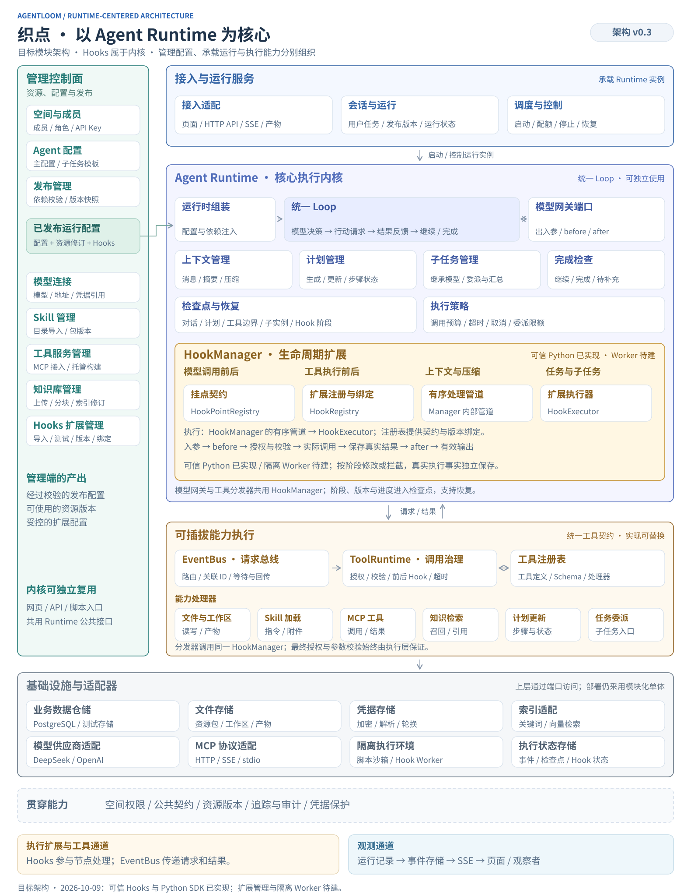
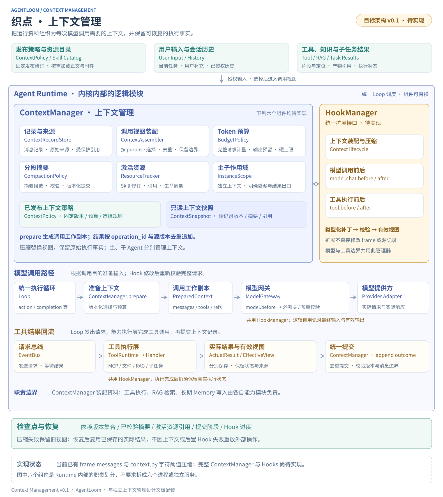

# AgentLoom 文档

团队低代码 Agent 平台的产品需求、Runtime 设计和开发记录。建议按“产品需求 → 总体架构 → Runtime 专题”的顺序阅读。

文档内区分**当前实现**与**目标设计**；验收标准、拟议接口和示例不表示功能已经落地。实现与验证记录保留原记录日期和当时状态。

## 产品与总体架构

| 文档                                  | 内容                                                        |
| ------------------------------------- | ----------------------------------------------------------- |
| [产品需求 v0.2](requirements-v0.2.md) | 多人空间、模型、Skill、工具、知识库、Agent 配置、发布及运行 |
| [总体架构 v0.3](architecture-v0.3.md) | 以 Agent Runtime 为核心的模块架构、分层、数据归属和执行链路 |
| [目录职责规划](directory-plan.md)     | 项目目录、当前模块、目标边界和依赖规则                      |

## Runtime 专题

| 文档                                            | 内容                                                                      |
| ----------------------------------------------- | ------------------------------------------------------------------------- |
| [Runtime 模块化实现 v0.1](runtime-modularity-v0.1.md) | 可替换模型/策略、工具能力隔离、版本与关闭生命周期、可运行注入示例 |
| [统一 Hooks 与用户扩展](hooks-design-v0.1.md)   | 生命周期挂点、模型和工具出入参、扩展契约、隔离执行及恢复                  |
| [上下文管理](context-management-design-v0.1.md) | 来源记录、模型可见视图、Token 预算、摘要、资源激活、实例隔离与 Hooks 协作 |
| [运行时事件总线](runtime-event-bus.md)          | 工具请求与响应、注册表、处理器、取消、超时和检查点                        |

## 开发与部署

| 文档                                          | 内容                                             |
| --------------------------------------------- | ------------------------------------------------ |
| [项目 README](../README.md)                   | 本地启动、运行条件、工具开发、验证命令和当前限制 |
| [PostgreSQL 使用说明](database-postgresql.md) | SSH 隧道、连接配置、迁移、隔离测试、部署与备份   |
| [实现记录 v0.2](implementation-v0.2.md)       | 工程拆分与可靠性迭代的阶段记录                   |

## 历史记录

| 文档                                       | 内容                                    |
| ------------------------------------------ | --------------------------------------- |
| [产品需求 v0.1](requirements-v0.1.md)      | 早期需求版本；当前产品范围优先参考 v0.2 |
| [实现记录 v0.1](implementation-v0.1.md)    | 第一版实现范围、验证结果与当时限制      |
| [静态 Demo 验证记录](demo-verification.md) | 旧前端演示的交互验证记录                |

## 配图

架构图统一使用 SVG，正文直接嵌入，点击可打开原图缩放查看。所有链接均使用仓库相对路径。

### 总体模块架构

### Runtime 与 Hooks

### 上下文管理

图源：[架构图生成脚本](diagrams/render_architecture.py)、[上下文图生成脚本](diagrams/render_context.py)。生成脚本使用 Python 标准库，直接生成 SVG。

## 文档维护

需求、设计与开发记录统一使用 Markdown 维护，已删除重复的 HTML/TXT 文档。前端与静态 Demo 保留运行必需的 `index.html`，页面中的需求文档入口指向 GitHub 上对应的 Markdown。项目根目录的 `requirements.txt`、`requirements-dev.txt` 和 `requirements.lock.txt` 是 Python 依赖清单，继续保留。

- 新增设计使用 `.md`，并在本目录页增加入口。
- 文档和源码链接使用相对路径；稳定章节跳转保留已有显式锚点。
- 修改架构图时同步保存图源和 SVG。
- 更新实现状态时写明实际完成的内容与验证结果，保留仍待实现或未验证的范围。
