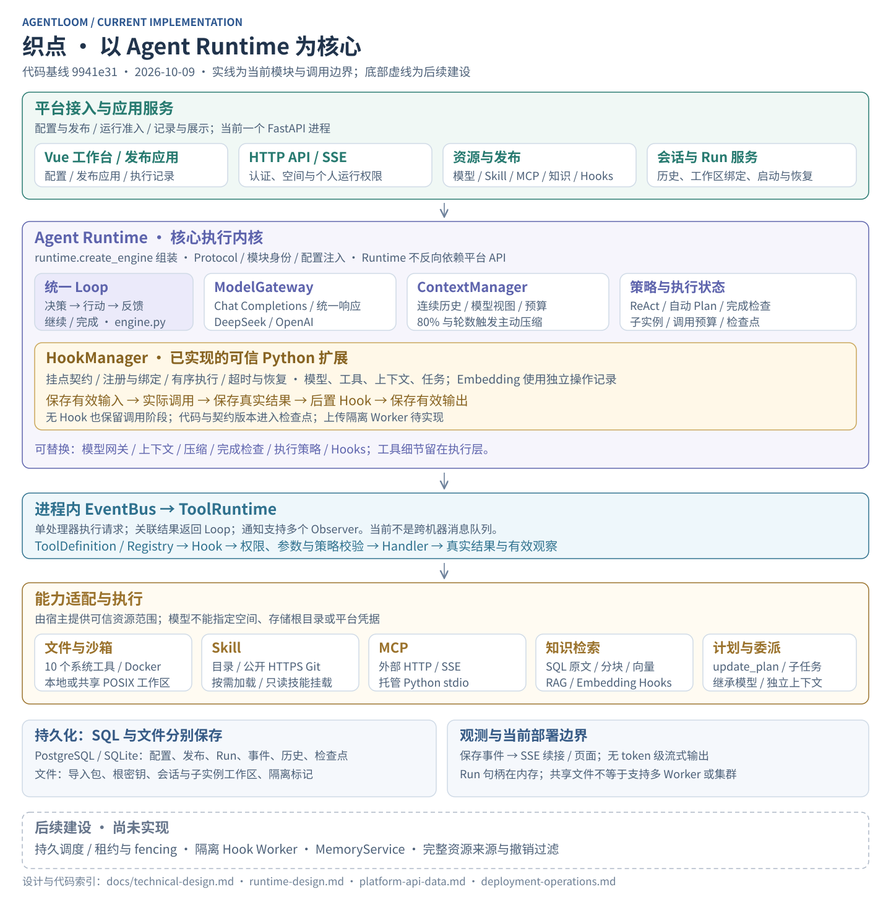

# AgentLoom 文档

推荐使用带目录和搜索的网页阅读：在项目根执行 `npm ci`、`npm run docs:dev`，打开 http://127.0.0.1:8767 。[站内首页](index.md) · [阅读指南](reading-guide.md) · [维护与部署](documentation-site.md)。

更新：2026-10-09；当前实现以 `master` 的 `9941e31` 为核对基线。建议从总体技术设计进入，再按 Runtime、平台接口或部署方向阅读。

## 当前完整技术文档

| 文档                                         | 阅读目的                                                   |
| -------------------------------------------- | ---------------------------------------------------------- |
| [总体技术设计](technical-design.md)          | 看清总体架构、需求实现矩阵、模块边界、核心流程和演进顺序   |
| [Runtime 详细设计](runtime-design.md)        | 理解可插拔 Loop、模型网关、策略、上下文、Hooks、工具与恢复 |
| [平台、API 与数据设计](platform-api-data.md) | 查前后端职责、鉴权、发布快照、资源管理、表结构和接口       |
| [部署与运维](deployment-operations.md)       | 启动、配置、迁移、共享工作区、Docker、备份与故障处理       |
| [源码目录与依赖](directory-plan.md)          | 从模块定位代码，区分现有接口和待拆分边界                   |
| [产品需求](requirements-v0.2.md)             | 对照已确认范围、验收要求与实现差距                         |
| [项目 README](../README.md)                  | 快速启动与当前能力概览                                     |

本组文档描述已核对的代码。目标接口、尚未实现的模块和未完成的实机验证都明确标注；需求中的验收标准不等同于已经全部通过。

## 当前实现架构图

图源：[render_current.py](diagrams/render_current.py)。主图表达实际执行路径，待建设能力放在独立区域。

## 专题参考

下列文档保留较细的契约、样例和阶段背景。总体状态及跨模块关系以本页上方的新文档为准。

| 文档                                                                | 内容                                                   |
| ------------------------------------------------------------------- | ------------------------------------------------------ |
| [Hooks 使用说明](hooks-runtime-v0.1.md)                             | SDK、挂点、绑定、v1/v2 兼容、指纹、执行阶段和示例      |
| [Embedding Hooks 与索引](embedding-hooks-v0.1.md)                   | 文档/查询处理链、冻结索引、导入/查询恢复和重建 API     |
| [事件总线](runtime-event-bus.md)                                    | 请求/响应、观察通知、注册工具、取消与恢复              |
| [系统工具、共享工作区与沙箱](system-tools-shared-workspace-v0.1.md) | 工具契约、共享存储选型、文件隔离、容器执行与探测       |
| [上下文实现 v0.2](runtime-context-v0.2.md)                          | 连续消息、视图、压缩触发与模型元信息                   |
| [模块化实现 v0.1](runtime-modularity-v0.1.md)                       | 第一阶段可插拔改造的动机和示例；部分签名已演进         |
| [PostgreSQL 专题](database-postgresql.md)                           | 隧道、数据库适配与历史接入验证；最新部署约束见运维文档 |

## 目标设计与历史记录

目标图表示职责划分，包含未实现的 Worker、完整资源追踪或 Memory；不能当作当前类/服务清单。

| 文档                                                | 状态                                                       |
| --------------------------------------------------- | ---------------------------------------------------------- |
| [总体目标架构 v0.3](architecture-v0.3.md)           | 早期总体方案及演进说明；当前完整架构见技术设计             |
| [Hooks 目标设计](hooks-design-v0.1.md)              | 扩展 Worker、管理与 SDK 目标；当前 Python SDK 见使用说明   |
| [上下文目标设计](context-management-design-v0.1.md) | 精细来源、资源追踪、Memory 等设计；当前实现见 Runtime 文档 |
| [产品需求 v0.1](requirements-v0.1.md)               | 历史产品范围                                               |
| [实现记录 v0.1](implementation-v0.1.md)             | 第一版实现及当时验证                                       |
| [实现记录 v0.2](implementation-v0.2.md)             | 工程演进的阶段记录，保留原日期和结果                       |
| [Demo 验证](demo-verification.md)                   | 旧静态演示验证，不是正式服务验收                           |

### 总体目标模块图

### Runtime 与 Hooks 目标职责

### 上下文目标职责

目标图源：[render_architecture.py](diagrams/render_architecture.py)、[render_context.py](diagrams/render_context.py)。所有生成脚本仅使用 Python 标准库，仓库只保留 SVG 图片。

## 维护规则

- 新需求更新产品需求；实现变化同时更新对应技术设计、接口和状态矩阵。
- 正文只维护 Markdown，图片用 SVG 并直接嵌入。网页由 VitePress 自动构建，HTML 产物不提交；不再手工维护同内容 HTML/TXT/PNG/JPG。
- 链接使用仓库相对路径；修改图时同步 SVG 与生成脚本；保留已有显式章节锚点。
- 测试记录注明代码基线、环境、时间与未验证项；历史数字不能冒充当前复验结果。
- API 导出契约位于 [openapi.json](../packages/contracts/openapi.json)，变更路由时同步校验。
- 产品运行需要的 `index.html` 和 Python 依赖 `requirements*.txt` 不属于待清理的文档副本。
