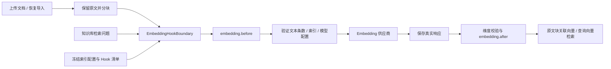

# Embedding Hooks 与知识库索引 v0.1

> **专题参考。** 当前跨模块架构与边界见[总体技术设计](technical-design.md)、[Runtime 详细设计](runtime-design.md)、[平台/API/数据](platform-api-data.md)和[部署运维](deployment-operations.md)，统一核对基线为 `9941e31`（2026-10-09）。本文保留专题契约和阶段验证。

更新：2026-10-09。本文说明已实现的可信 Python 扩展接口和知识库 API。通用契约见 [Hooks 运行时使用说明](hooks-runtime-v0.1.md)，完整目标见 [统一 Hooks 设计](hooks-design-v0.1.md)。

Embedding Hooks 在文本转向量前后执行。文档入库和问题检索都经过同一个执行边界，复用 `HookManager` 的版本绑定、只读载荷、补丁校验、超时和恢复机制；不需要修改 Agent Loop。

## 1. 执行路径与模块



| 模块                                                    | 职责                                                                                                    |
| ------------------------------------------------------- | ------------------------------------------------------------------------------------------------------- |
| `packages/runtime/agentloom_runtime/embedding_hooks.py` | 提供独立执行边界，验证输入映射、响应索引与维度；真实结果先保存，after 只读。                            |
| `packages/runtime/agentloom_runtime/hooks/`             | 复用扩展注册、匹配、执行管道和操作状态机；Embedding 有独立挂点 Schema。                                 |
| `packages/runtime/agentloom_runtime/provider.py`        | `embedding_response()` 返回向量、提供方索引及可选用量 / 请求 ID；旧 `embeddings()` 仍返回有序向量列表。 |
| `apps/api/agentloom/services/embedding.py`              | 冻结并校验知识库索引，解析当前凭据，加密保存操作检查点，隔离空间与操作身份。                            |
| `apps/api/agentloom/services/knowledge_imports.py`      | 保存原始文件和每批操作 ID，全部批次完成后原子提交文档；原子建立新索引及全部导入任务。                   |
| `apps/api/agentloom/knowledge.py`                       | 原文分块与混合检索，按知识库固定的索引配置生成查询向量。                                                |
| `apps/api/agentloom/services/knowledge_search.py`       | 将 Agent 的工具调用检查点与各知识库向量化操作关联，同一次调用恢复时复用已完成批次。                     |
| `apps/api/agentloom/routes/knowledge.py`                | 暴露创建、上传、恢复、检索及创建新索引版本的 API。                                                      |

Agent 自身的 `hooks` 不能绑定 `model.embedding.*`。知识库可能被多个 Agent 共用，其向量处理配置由知识库持有，Agent 发布快照引用对应知识库和文档版本。

## 2. 挂点与只读上下文

| 挂点                                    | 输入                                                                                                     | 允许行为                                                                                                         |
| --------------------------------------- | -------------------------------------------------------------------------------------------------------- | ---------------------------------------------------------------------------------------------------------------- |
| `model.embedding.before`                | `texts=[{"index":0,"text":"..."}, ...]`、模型 ID、索引签名、请求维度、`encoding_format="float"`、purpose | `Continue`、`Reject` 或 `PatchInput({"texts": [...]})`；每条文本可修改，但不能增减条目、改变索引或交换索引位置。 |
| `model.embedding.after`                 | 排好序的 `vectors`、`indices`、`dimension`，及可选 `usage`、`provider_request_id`                        | 首期只读，需要 `HookDefinition(observation=True)`，只能返回 `Continue`。                                         |
| `operation.error` / `operation.finally` | 阶段、实际执行状态、已完成 Hook 数量和结构化错误类型                                                     | 只读诊断，不改变真实执行结果。                                                                                   |

所有载荷与 `ctx.config`、`ctx.scope` 深只读。使用 `ctx.kb_id`、`ctx.index_revision`、`ctx.index_signature`、`ctx.operation_id`、`ctx.purpose`、`ctx.space_id`、`ctx.actor_id` 获取宿主提供的作用域；没有运行任务时 `ctx.run_id` 为 `None`。模型 Key、数据库连接和实际执行回调不传给 Hook。

默认 purpose 同时匹配 `document` 和 `query`。知识库 API 当前要求所有绑定同时覆盖这两个用途，保证双方使用一份冻结的处理链；不开放两套独立处理链。Runtime 底层允许显式 purpose 筛选，宿主若扩展这一用法，必须自行把两条配套链一同固定到索引版本。

即使没有配置 Hook，宿主仍校验输入、向量数量、索引唯一性、有限数值和维度。模型、索引签名、输出格式及请求维度均不能通过补丁修改。after 不能改写真正模型调用的成功 / 失败状态，也不能替换向量；after 自身失败仍可阻止当前导入完成。

## 3. 注册与绑定示例

由部署入口在开始接收请求前注册可信扩展；每个 API Worker 使用同一版本。下面的扩展清理文本两端空白：

```python
from agentloom.services.hooks import register_trusted_hook
from agentloom_runtime.hooks import HookDefinition, PatchInput

async def trim_embedding_text(ctx, payload):
    return PatchInput({
        "texts": [
            {"index": row["index"], "text": row["text"].strip()}
            for row in payload["texts"]
        ],
    })

register_trusted_hook(HookDefinition(
    "trim-embedding-text", "v1", trim_embedding_text, replay_safe=True,
))
```

创建知识库，`embedding_id` 选择已有 Embedding 模型连接：

```http
POST /api/wiki
Content-Type: application/json
```

```json
{
  "name": "团队 Wiki",
  "embedding_id": "已有向量模型连接 ID",
  "embedding_hooks": [
    {
      "binding_id": "trim-text",
      "hook_id": "trim-embedding-text",
      "version": "v1",
      "point": "model.embedding.before",
      "purposes": ["document", "query"],
      "config": {}
    }
  ]
}
```

`embedding_dimensions` 可选；填写后作为提供方请求参数并校验返回值，模型必须支持该维度。未填写时使用模型默认维度；入库成功后固定实际学习到的维度，后续入库与查询都必须一致。

文本补丁仅影响发送给向量模型的文本。**上传原文、引用内容及行号保持原样**，便于查看来源；脱敏 Hook 不代表原始知识文档已脱敏。若要改变存储原文，应先处理上传文件。

不连接 API / 数据库也能运行边界示例：

```bash
PYTHON_DOTENV_DISABLED=1 PYTHONPATH=packages/runtime .venv/bin/python examples/hooks/embedding_demo.py
```

示例使用确定性向量替身和内存检查点，演示 document/query、前置文本处理和后置只读观察。源码见 [`examples/hooks/embedding_demo.py`](../examples/hooks/embedding_demo.py)。生产宿主必须提供真实持久化回调。

## 4. 索引固定与版本变化

创建知识库时保存 `embedding_index`：包含模型公开配置、绑定的具体版本、代码哈希、配置、排序与失败策略、维度配置和索引修订，并生成签名。模型 Key 不进入签名，允许原模型连接轮换凭据。模型 ID、提供方地址、Hook 代码或配置发生变化时，已有索引不会自动跟随；恢复与检索会校验一致性。

提供方按索引乱序返回向量时，先保存实际响应，再按输入索引恢复顺序。向量索引缺失 / 重复、数量变化、NaN / Infinity、布尔值或维度不一致都会阻止该批次入库。返回值已经拿到但不合法时，恢复不会为修复响应而自动重发模型请求。

要更换处理链，创建新的知识库索引：

```http
POST /api/wiki/{source_id}/reindex
Content-Type: application/json
```

```json
{
  "name": "团队 Wiki · 新索引",
  "embedding_hooks": [
    {
      "binding_id": "trim-text",
      "hook_id": "trim-embedding-text",
      "version": "v2",
      "point": "model.embedding.before"
    }
  ]
}
```

可选参数还包括 `embedding_id` 和 `embedding_dimensions`。响应含新知识库 `id`、整体 `status` 和各文件导入 `imports`。新知识库记录 `derived_from`，使用下一索引修订并重新向量化原文；原知识库、原向量和已经发布的 Agent 快照保持不变。完成新索引后，在 Agent 草稿选择新知识库并重新发布。

如果新索引有导入失败，通过 `POST /api/wiki/{new_id}/reindex/resume` 继续未完成导入。整体就绪状态要求所有文件都完成，失败批次不能悄悄成为一个就绪的新索引。

旧知识库没有冻结清单时，只能继续使用空 Hook 链及原有向量签名；要启用扩展，应显式建立新索引。

## 5. 上传、检索和中断恢复

文件导入先保存原文、分块和批次操作 ID，再执行每批最多 32 段文本的向量化。所有批次完成后才提交这个文件的文档与向量；中途失败保留加密导入记录。

| API                                              | 用途                                                                                                     |
| ------------------------------------------------ | -------------------------------------------------------------------------------------------------------- |
| `POST /api/wiki/{id}/upload`                     | 原 multipart 文件上传；每个结果增加 `import_id`。失败结果包含可用的 `operation_id` 和 `retry_required`。 |
| `GET /api/wiki/{id}/imports`                     | 查询有权限访问的导入状态元数据。                                                                         |
| `POST /api/wiki/{id}/imports/{import_id}/resume` | 继续原导入及其批次，不重新创建文档；请求体默认 `{}`。                                                    |
| `GET /api/wiki/{id}/embedding-operations`        | 查询操作状态、索引签名与是否需要明确重试，不返回文本、向量和凭据。                                       |
| `POST /api/wiki/{id}/search`                     | 请求 `{"query":"问题"}`；需要恢复时带原 `embedding_operation_id`。                                       |

操作检查点独立保存 `original_input`、最终输入、`raw_output`、有效输出及 Hook 执行游标。真实响应先保存，之后才执行 after。after 的观察扩展失败后，用相同导入 ID / 操作 ID 恢复，会继续处理已保存响应，不会再次调用向量模型。

如果请求已经发出却没有保存完整响应，返回 `retry_required=true`。查询接口使用 HTTP 409；调用者明确决定重试后，再传：

```json
{
  "query": "与原操作完全相同的问题",
  "embedding_operation_id": "上次返回的 operation_id",
  "retry_unknown_models": true
}
```

文件导入恢复与整库重建恢复采用同名布尔字段。默认 `false`；字符串 `"true"` 不能替代布尔值。明确重试可能再次计费，只授权重发结果未知的模型调用，已经完成的 before / after 不会因此重放。恢复时输入、操作身份或索引配置变化都会被拒绝。

Agent 的 `knowledge_search` 在工具调用检查点中保存每个知识库的操作 ID，再开始检索。同一次工具调用中，即使第一个知识库完成、第二个失败，恢复时也会复用第一个的结果；新的工具调用使用新的操作 ID，不会仅凭问题相同而混用记录。向量化或 Hook 需要恢复时保留待执行工具；Run 的状态查询与恢复接口沿用 `requires_model_retry`、`retry_unknown_models` 显式重试约定。

这套工具调用恢复规则用于新建 Run。升级前的检查点继续使用原工具绑定和不可自动重放策略，避免因修改工具契约而阻断历史任务恢复。新的检索适配器负责自身执行时限，超时会保留待恢复调用；用户取消仍正常传播。

未声明 `replay_safe=True` 的 Hook 在自身执行结果未知或失败后仍需要人工核对；允许模型重试不能越过这个限制。after 观察扩展可以显式使用 `failure_policy="continue"`，将普通观察失败记录下来后继续，真实向量仍不可改写。

## 6. 存储、验证与当前限制

`004_embedding_operations.sql` 同时提供 SQLite 和 PostgreSQL 迁移，增加 `embedding_operations` 与 `knowledge_imports`。操作与导入检查点使用应用现有加密机制保存；公开列表只返回元数据，操作归属和空间权限在宿主校验。现有原始知识文档的存储策略不因此改变。

测试覆盖 Hook 输入映射、只读输出、作用域匹配、维度异常、持久化和取消，及平台的原文保留、双向预处理、失败导入恢复、明确重试、不同知识库的索引隔离、代码变化拦截与创建新索引版本。测试使用确定性模型替身及临时数据库，不需要真实模型 Key；完整验证命令仍是 `PYTHON_DOTENV_DISABLED=1 bash deploy/check.sh`。

当前没有 Hook 上传 / Git 安装、可视化管理和不受信任代码 Worker。Embedding 管理与恢复入口先通过 API 提供；已有上传和检索页面沿用这些执行路径。本轮没有建立分布式执行租约，进程内并发保护不能替代集群协调；也不承诺外部调用 exactly-once。真实供应商连通性、提供方特定维度支持和生产数据库迁移需要在相应部署环境单独验证。
