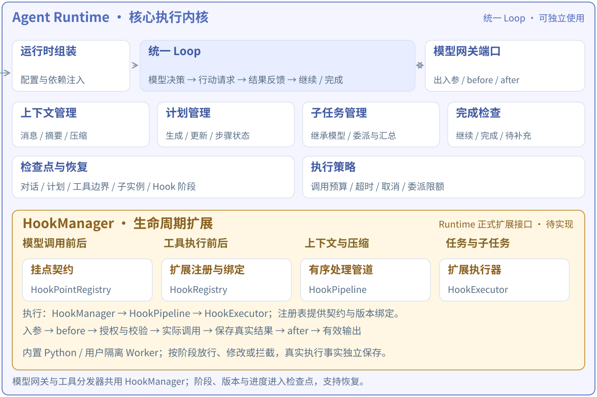

架构补充 · 设计 v0.1 · 2026-10-02

# 统一 Hooks：模型、工具与用户扩展

目标：用户可以读取授权范围内的模型与工具入参、出参，在明确阶段修改数据或阻止执行，并注册自己的扩展。Runtime 提供统一机制，ModelGateway、ToolRuntime 和其他能力模块提供类型明确的挂点。

> **实现状态：** 本文为拟议接口与行为契约，SDK、装饰器、配置字段和执行器尚未实现。现有 EventBus.subscribe 只提供观察通知。本文示例不可直接作为当前平台可用 API 调用。

[返回总体架构与 HookManager](architecture-v0.3.md#hooks)

## 1. 一个 Hooks 系统，在各自执行边界调用

[](diagrams/agent-runtime-hooks.svg)

2026-10-02 更新 · 统一 Hooks 的目标模块与出入参流程，尚待实现。[可缩放 SVG](diagrams/agent-runtime-hooks.svg) · [完整模块架构图](diagrams/abstract-module-architecture.svg)

### 模型边界 · ModelGateway

接收标准模型输入，执行 before，校验加工后的输入，再经供应商适配器发起请求；得到标准响应后执行 after，将结果返回 Loop。

### 工具边界 · ToolRuntime

接收总线请求，查工具定义与授权，执行 before，再校验参数并调用 Handler；记录真实结果后执行 after，将结果交给总线回传。

```text
Loop ── 模型请求 ──→ ModelGateway ──→ 供应商适配器
  │                       │
  │                       ├── before / after / error / finally ──┐
  │                       │                                    │
  └── EventBus ──→ ToolRuntime ──→ Handler                      │
                          │                                    ▼
                          └── before / after / error / finally → HookManager
                                                                 │
                                  HookRegistry → HookPipeline → HookExecutor
```

Loop 只依赖模型与工具契约。各执行边界调用同一个 HookManager 实现，不另建互不兼容的模型 Hooks、MCP Hooks、文件 Hooks。HookManager 是 Runtime 的模块，工具分发器通过注入接口使用它；能力层不反向导入具体 Engine。

| 模块              | 职责                                                                                                   |
| ----------------- | ------------------------------------------------------------------------------------------------------ |
| HookPointRegistry | 定义挂点名称、输入/输出 Schema、允许动作、可修改字段和失败约束。例如 model.chat.before 与 tool.after。 |
| HookRegistry      | 注册扩展 ID、版本、入口、匹配范围、配置 Schema、所需权限；管理已发布绑定。                             |
| HookManager       | 执行边界的唯一入口；按挂点、实例与操作匹配扩展，创建只读上下文，关联运行与调用记录。                   |
| HookPipeline      | 有序执行阶段内的 Hook，逐次应用并校验补丁，处理拒绝与异常，记录执行到哪个 Hook。                       |
| HookExecutor      | 执行具体用户函数；管理进程内或隔离执行、超时、取消、资源和数据大小限制。                               |

这些是逻辑职责，可以先放在一个小型 hooks 包中，不要求拆成多个服务。业务权限校验、预算和运行状态机仍是平台内建规则。

## 2. Hook 能看到哪些模型和工具出入参

| 挂点                           | 可读取的业务数据                                                    | 首期可修改范围                                                                                                     |
| ------------------------------ | ------------------------------------------------------------------- | ------------------------------------------------------------------------------------------------------------------ |
| model.chat.before              | 模型配置标识、messages、当前可用 tools、推理参数、purpose。         | 允许的消息内容、附加消息、采样或输出长度参数；不改变模型绑定、凭据、工具权限或工具 Schema。                        |
| model.chat.after               | 标准化回答正文、tool_calls、finish_reason、usage 与提供方请求标识。 | 首期只修改回答正文与扩展标注。tool_calls 与真实 usage/状态只读；如果需改工具参数，使用 tool.before。               |
| model.embedding.before / after | 输入文本、维度/格式配置，或返回的向量与用量。                       | 与 Chat 使用独立 Schema。before 可按允许规则处理文本；after 首期只读向量，保持输入条数、顺序、维度和索引签名一致。 |
| tool.before                    | 稳定工具 ID、发布修订、名称、Schema、arguments、调用标识。          | 只修改该工具 arguments。实际执行前再次校验 Schema、授权和工作区路径等限制。                                        |
| tool.after                     | 真实执行状态、业务结果、产物/引用、耗时及供模型使用的结果视图。     | 只修改模型可见的结果内容或脱敏投影；真实状态、外部副作用、调用 ID、产物归属和来源引用保持独立且受保护。            |
| operation.error / finally      | 操作类型、阶段、结构化错误、真实执行状态、已完成到哪个 Hook。       | 诊断标签与清理结果；首期不能替换成功结果或自动重试。                                                               |

**这里的“出入参”是标准化业务数据：** 用户 Hook 可以读取被授予的完整 messages、arguments 和结果，不限于摘要。原始 HTTP 请求头、API Key、任意环境变量、数据库连接和整个 Engine 不进入契约。凭据由协议适配器在最终请求时按需注入；若需协议级诊断，由平台提供专门的受控适配扩展。

同一聊天网关也会用于主任务、子任务、上下文压缩和完成检查。绑定必须支持 purpose 过滤，例如 action、compaction、completion；默认业务回答改写扩展只绑定 action，避免破坏完成检查的结构化 JSON。Embedding 使用单独挂点；资料入库、连接测试等无 Run 的操作需要显式作用域，不能默认套用某个 Agent 的 Hook。

**Embedding 与知识索引一起固定：** 预处理 Hook 的代码版本、配置和模型配置共同构成索引签名。文档入库与查询使用同一份冻结的 Embedding 配置；如需不同预处理，必须显式声明文档/查询两条配套链并一起计入签名。Agent 绑定不能覆盖已有知识库的预处理链。修改配置需要生成新的索引版本并重建向量，同时保持文本条数、顺序和文档映射关系。

模型输出中的 tool_calls 是结构化协议，不对整个消息做任意字符串替换。即使 Hook 只改正文，最终输出也必须保留调用 ID 唯一性、完整消息关联和有效的动作/回答。模型不能指定 Hook ID、优先级或强制变更 Hook 配置。

## 3. 只读上下文 + 类型化载荷 + 显式结果

```text
HookContext（平台提供，只读）
  space_id / actor_id / run_id? / instance_id?
  operation_id / parent_operation_id / call_id?
  point / purpose / binding_id / published_revision
  deadline / cancellation / scoped_read_handles

TypedPayload（该挂点的业务输入或输出，只读视图）
  ChatInput | ChatOutput | EmbeddingInput | ToolInput | ToolOutput ...

HookResult
  Continue()                    保持原值
  PatchInput(patch)             修改允许的入参字段，仅 before
  PatchOutput(patch)            修改允许的输出视图，仅 after
  Reject(code, reason)          阻止当前阶段，仅允许拒绝的 before
```

PatchInput / PatchOutput 是此前架构中 Patch 的类型化形式。补丁按该挂点的字段规则应用，未声明字段直接拒绝；修改只发生在调用工作副本，不直接写共享消息历史或 frame/state。后一个 Hook 看到前一个经校验的有效修改。

首期不开放任意 around(next) 控制权；不允许 Hook 自行决定执行底层调用两次、直接结束整个 Agent 或覆盖工具成功/失败。后续若需缓存命中等短路功能，应增加显式 ShortCircuit 类型，并记录“实际未调用”，独立设计计费与来源规则。

## 4. 一次调用的统一处理流程

1. **固定调用身份：** 生成 operation_id，读取当前发布绑定，确定工具或模型契约及初步授权。
2. **运行 before 管道：** 匹配扩展，依次获得 Continue / PatchInput / Reject；每次补丁先校验结构，链末再做完整权限、预算和语义校验。
3. **保存最终输入与阶段：** 记录可执行输入摘要/受保护引用，确认是否即将发起外部调用。
4. **执行底层操作：** 由模型适配器或工具 Handler 执行，Hook 不直接拿底层 execute 回调。
5. **保存真实执行事实：** 区分 not_started、running、succeeded、failed、unknown；保存真实结果或受保护的结果引用。
6. **运行 after 管道：** 在成功结果的工作视图上加工输出；真实结果与有效输出分别留存。
7. **错误和清理：** 失败进入 operation.error，存活进程中在退出时执行限时 finally；清理错误不能覆盖原始错误或吞掉取消。
8. **返回与继续：** 有效结果回到调用者；模型回答和工具结果再由 Loop 按统一协议处理。

首期采用**阶段管道**：before、after、error、finally 各自按固定的 priority 与发布绑定顺序执行，不隐式采用成对中间件的反向退出规则。error / finally 中 Hook 自身的错误只形成诊断记录，不再次递归触发同一个错误管道；关键状态始终保留原始失败或取消原因。同一个绑定不会因为同时匹配 Agent 和某个工具而执行两遍；同一扩展若需要不同配置多次执行，使用不同 binding_id 显式表达。

平台强制规则和最后一次授权/Schema 校验不能被用户禁用。平台、空间、Agent、特定工具/模型的扩展合并成发布时确定的链；作用域决定匹配范围，优先级只在允许的阶段里排序，不能用优先级绕过强制规则。

## 5. 用户如何写和绑定扩展

提供 Python Hook SDK。用户编写函数，声明挂点、匹配范围和参数配置；平台导入后生成独立版本。与工具 SDK 类似，但 Hook 接收执行节点数据并返回决策，工具负责实际业务动作。

以下为拟议 SDK 示例，不是当前已安装的库或可用装饰器。

```python
@hook(point="tool.before", target="orders.search")
async def limit_order_search(ctx, call):
    # orders.search 是示例工具，假定它声明了整数 limit 参数。
    limit = call.arguments.get("limit", 20)
    return PatchInput({
        "arguments": {"limit": max(1, min(limit, 100))}
    })

@hook(point="model.chat.after", purpose="action")
async def normalize_answer(ctx, reply):
    # 正文可以为空，同时仍包含有效 tool_calls。
    if reply.content is None:
        return Continue()
    return PatchOutput({"content": reply.content.strip()})
```

拟议包结构：

```text
order-hooks/
  hook.yaml                 ID、API 版本、入口、挂点、配置 Schema、权限
  hooks.py                  扩展函数
  requirements.txt          可选依赖
```

发布绑定示例中的 tools 是已解析的稳定工具 ID，不依赖容易变化的展示名或模型函数别名：

```text
hook_ref: limit-order-search@v1
point: tool.before
match:
  tool_ids: [orders-search]
  instances: [main, child]
priority: 100
timeout_ms: 1000
failure_policy: block
config:
  max_limit: 100
```

SDK 示例中的 target 别名在发布时解析为 tool_ids；实际扩展使用 config 中的参数可以复用同一份代码。绑定状态、代码哈希、依赖、配置、匹配条件、排序和错误策略都进入发布版本。

**管理流程：** 导入 Hook 包 → 声明所需数据与权限 → 用样例出入参测试 → 发布 Hook 版本 → 绑定 Agent 或具体能力 → 重新发布 Agent。子 Agent 按发布策略继承 Hook 链，携带自己的 instance_id 与资源范围；如果配置子任务专属扩展，作为主 Agent 发布配置的一部分。

**新增业务逻辑**只需注册已有挂点；**新增生命周期节点**则由对应模块声明新的 HookPoint（名称、Schema、可修改字段与失败规则）并在真实边界调用 HookManager。仅声明一个字符串事件名不会自动创造新的执行阶段。

## 6. 运行用户代码与外部集成

| 扩展来源                  | 执行方式                                              | 边界                                                                                    |
| ------------------------- | ----------------------------------------------------- | --------------------------------------------------------------------------------------- |
| 平台内置、受信任扩展      | 可以作为进程内 async Python 函数执行。                | 仍遵循同一输入输出契约、预算、超时与取消规则。                                          |
| 团队上传 / Git 导入的扩展 | 通过隔离 Hook Worker 执行，使用版本化 JSON 请求响应。 | 限制文件、网络、依赖、内存、运行时间与输出大小；不能把上传代码直接 import 到 API 进程。 |
| 需要外部系统的扩展        | 使用显式授权的连接器或后续受控远程 Hook 适配。        | 只有绑定允许的数据可发送；远程服务不可默认获得完整 messages、结果或平台密钥。           |

首期可先完成可信 Python Hook 的机制，再开放隔离上传。现有 Docker 执行环境仍需实机验证，不能把 Worker 方案描述为已可用。若后续允许 Hook 请求其他能力，需要记录 parent_operation_id、限制嵌套深度并检测同一 Hook/操作递归；第一版不把通用 ToolInvoker 暴露给用户 Hook。

用户可以读取授权的业务内容，但审计界面不默认明文展示所有 messages 和返回结果。记录 binding_id、输入输出摘要、补丁摘要、决策和耗时；恢复确需完整载荷时使用受保护的存储引用和保留期限。Hook 代码日志、异常和诊断信息也需同样处理。

## 7. 超时、错误、取消与恢复

| 场景                        | 处理规则                                                                                                                               |
| --------------------------- | -------------------------------------------------------------------------------------------------------------------------------------- |
| before 拒绝或关键 Hook 失败 | 底层操作尚未执行；返回结构化拒绝/HookFailed，保留阶段信息。工具拒绝可反馈模型调整方案，模型调用被拒绝则由 Run 策略决定失败或等待补充。 |
| 纯观测 Hook 失败            | 可以记录后继续；纯观测扩展只返回 Continue 和标注，禁止依赖它完成必需修改。                                                             |
| 工具成功，after Hook 失败   | 记录“执行成功，结果处理失败”，保留真实结果。恢复只继续未完成且允许重算的后处理，不重新执行工具。                                       |
| 模型成功，after Hook 失败   | 保留已收到的响应与用量；先恢复结果处理，避免再次请求已计费模型。                                                                       |
| 取消 / deadline 到期        | 向当前 Hook 与底层操作传播取消；清理使用短时限，不能在 finally 中继续整个任务。                                                        |
| 执行中断且结果未知          | 以 unknown 保存，先核对实际状态；on_error 不自行重试。含外部副作用的 Hook 同样遵循这个规则。                                           |
| 进程崩溃                    | 不能保证 finally 已运行。恢复根据持久化边界判断动作是否可重算；必要补偿是单独操作。                                                    |

检查点至少保存：Hook 链版本、当前阶段与 binding_id、最终输入引用、真实结果引用、有效输出引用、已完成 Hook 及必要扩展状态。允许重算的纯数据转换与可能产生外部副作用的扩展分开声明；幂等键由平台生成，外部服务是否支持幂等也要实际确认。

model.chat.before / after 默认包围一次**逻辑模型调用**。网关内部有限次网络尝试复用已校验输入，按 attempt_id 记录观测信息，避免每次重试重复注入消息或发送通知。只有显式的 attempt 观测扩展才逐次运行。

当前模型尚未提供 token 级输出。以后增加流式输出时，需另设 chunk 级只读观测或受限转换点；tool_calls 的流式参数必须组装完整、校验并执行 tool.before 后才能调用。已发送给用户的内容不能被最终 after Hook 追溯改写。

## 8. 落地顺序与验收

1. 先定义类型化 HookPoint、Context、Result、注册/绑定契约，完成纯内存 Pipeline。
2. 接入 ModelGateway 与 ToolRuntime，覆盖模型和所有已注册工具的 before / after / error / finally；内置工具和 MCP 共用工具边界。
3. 补齐检查点中的 Hook 阶段、最终输入与真实结果持久化；验证 after 失败恢复不重发模型/工具请求。
4. 增加上下文、子任务、运行起止等挂点，继承同一匹配、权限、超时和恢复规则。
5. 提供开发 SDK、样例数据测试器、版本绑定，再实现隔离 Hook Worker 和管理页面。

验收重点：顺序稳定、参数修改有效且重校验、返回视图与执行事实分开、模型 tool_calls 协议完整、子任务范围不越权、取消有效、恢复不重复副作用，以及新增扩展无需修改 Loop。

本设计与 Runtime 核心架构配套；落地前不将示例声明为现有功能。
