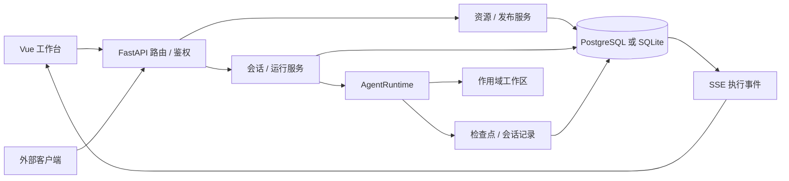
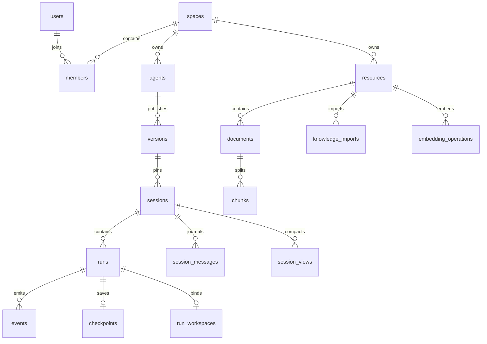

# 管理平台、运行 API 与数据模型

基线：`9941e31`；核对日期：2026-10-09。本文描述该提交的实际实现，不把需求草案中的目标当作已交付能力。

接口定义见 [OpenAPI 快照](../packages/contracts/openapi.json)，运行服务同时提供 `/api/openapi.json` 和 `/api/docs`。
OpenAPI 的请求模型较完整，但部分返回值仍是普通 `dict`，没有完整的响应 Schema；下面补充实际返回和状态语义。
本次核对只读取源码，没有读取本地 `.env`、连接真实数据库或调用供应商。

## 1. 平台与 Runtime 的边界

管理平台负责账号、空间、资源、Agent 草稿与发布、运行准入、历史和接口；AgentRuntime 负责一次任务内的执行循环。
网页与外部 API 都通过同一运行服务创建 Engine，不各自实现一套 Loop。



源代码入口：[app.py](../apps/api/agentloom/app.py)、[routes](../apps/api/agentloom/routes)、[services](../apps/api/agentloom/services)、[Runtime 组装](../packages/runtime/agentloom_runtime/runtime.py)。

## 2. 身份、空间与权限

| 对象         | 当前规则                                                                                                 |
| ------------ | -------------------------------------------------------------------------------------------------------- |
| 初始化       | 平台无用户时，`setup` 创建第一个 owner、默认“团队空间”及邀请口令；再次初始化返回 409。                   |
| 成员注册     | 使用空间邀请码创建新账号和 `member` 关系；已有账号不能通过该接口再次加入其他空间。                       |
| 登录         | 邮箱与密码验证后创建空间绑定的网页 token；当前没有空间切换接口。                                         |
| 网页身份     | `loom_session` Cookie，HttpOnly、SameSite=Strict，有效期 7 天；Secure 由部署配置开启。                   |
| API 身份     | `Authorization: Bearer <空间 API Key>`；Key 绑定签发人的 user_id 和 space_id，有效期 90 天。             |
| owner 专属   | 模型创建、修改、发现、测试、删除；查看邀请码；创建、列出和撤销空间 API Key。                             |
| 普通成员     | 访问空间 Agent 与公共资源；创建/编辑/发布 Agent；管理 Skills、工具和知识库。                             |
| 私有执行数据 | Run 状态、事件、恢复、取消、产物和 Session 消息必须属于当前 user_id；空间 owner 也不能读取其他人的运行。 |

鉴权每次连接 `tokens → users → members`，检查 token 类型、有效期及成员关系。
Bearer 请求只接受 `kind=api`；Cookie 请求只接受 `kind=session`，二者不能直接互换。
API Key 没有每个 Agent 的独立 scope，也没有独立服务账号；使用同一 owner 的 Key 会共享该 owner 的运行身份。
角色只有 `owner/member` 的基础区分，没有完整 RBAC、资源级 ACL、成员移除、角色编辑、邀请过期或邀请轮换接口。
网页登录在多个成员关系中没有显式选空间流程，因此数据库结构可表达多空间，不代表产品已支持完整多空间管理。

密码保存为带随机盐的 PBKDF2-SHA256，token 保存 SHA-256 摘要，API Key 原文只在创建时返回一次。
使用 Cookie 的跨站写请求检查 Origin；这不是通用 CORS 配置。登录/注册/初始化共用进程内 IP 限流：每分钟 10 次。
来源：[dependencies.py](../apps/api/agentloom/dependencies.py)、[认证路由](../apps/api/agentloom/routes/auth.py)、[空间路由](../apps/api/agentloom/routes/spaces.py)、[security.py](../apps/api/agentloom/security.py)。

## 3. 空间资源与发布

四类公共资源统一保存在 `resources`，以 `kind=models/skills/tools/wiki` 区分；各类配置在 `payload` JSON 文本内。
资源读取与写入由服务端从身份确定 space_id，不允许模型或浏览器自由选择其他空间。
公开响应递归剔除 `secret/api_key/token/path/image/headers_secret` 等字段，不返回资源所在服务器的物理路径。

### 3.1 Agent 配置

| 字段                    | 约束 / 含义                                                                                     |
| ----------------------- | ----------------------------------------------------------------------------------------------- |
| `name / prompt`         | 名称 1–100 字符；主 Prompt 最多 30,000 字符。                                                   |
| `model / mode`          | 模型资源 ID；主 Agent 模式 `react` 或 `plan`。                                                  |
| `skills / tools / wiki` | 引用本空间资源；分别最多 30 / 30 / 20 个 ID。                                                   |
| `subs`                  | 最多 10 个内部子 Agent 定义：id、name、description、prompt 及自己的资源列表。                   |
| 子 Agent 模型 / 模式    | 没有独立字段；继承主 Agent 模型，执行主任务委派，不单独发布为应用。                             |
| `context_policy`        | 默认占用比例 0.8 触发，压缩目标 0.6；可选 user_turns/model_steps，max_compaction_calls 默认 4。 |
| `hooks`                 | 最多 32 个可信已安装 Hook 绑定；不接受上传代码，Embedding Hooks 属于知识库索引。                |

草稿保存和发布是两个操作：草稿可以尚未配置完整；运行只接受已发布版本。
发布校验聊天模型类型、资源空间、工具 ready、知识库存在可检索文档、子 Agent ID 唯一及 Hook 绑定可解析。
发布在事务锁内递增版本号，写入 `versions.snapshot`，更新 `agents.latest`。
快照包含主/子配置、模型配置、资源配置、知识库文档 ID 集合、有效上下文策略和冻结 Hook 清单。
这些是配置快照；没有把资源包文件复制成内容寻址归档，也没有独立的发布回滚 API。
选旧 `version` 即可运行旧版本；改草稿和发布新版本不会改动已有 Session 的版本。

删除资源前检查所有草稿、发布快照和知识库 embedding 引用；被发布引用的资源不能通过通用删除接口删除。
当前草稿/快照引用检查使用序列化文本查找 ID，属于保守阻止删除，没有单独的关系型引用表。
没有 Agent 删除、版本删除、取消发布、定时发布、配置审批或发布差异 API。
来源：[schema.py](../apps/api/agentloom/schema.py)、[发布服务](../apps/api/agentloom/services/agents.py)、[Agent 路由](../apps/api/agentloom/routes/agents.py)、[资源路由](../apps/api/agentloom/routes/resources.py)。

### 3.2 Secret 保存与轮换

模型和外部 MCP 的 Key 使用 Fernet 加密后保存；平台密钥文件为 `data/encryption.key`，首次创建权限 0600。
备份数据库时必须一并保管该密钥；它不在数据库中，也没有 KMS、版本化密钥轮换或重加密管理 API。
公开快照不会显示 secret，但数据库中的发布快照实际包含资源的加密 secret 副本，不能理解为“发布完全不保存凭据”。
运行聊天模型时按资源 ID 读取当前 secret，连接地址、模型 ID 等仍取发布快照，因此同连接更新 Key 可用于旧发布版本。
向量化按冻结的索引身份校验当前模型连接，再取得当前 Key；已被知识库引用的向量模型禁止直接更换连接身份。
外部 MCP 当前没有修改 Key 的专用接口；运行使用发布快照的工具 secret，不能声称所有工具凭据均可无发布轮换。
聊天模型 PUT 仍允许更换 provider/base_url 后填写新 Key，而旧发布保留旧地址；当前应新建模型资源、重新绑定并发布来迁移连接。
这处“旧地址配新 Key”的组合尚缺服务端一致性保护；不要把更换连接与只轮换同连接 Key 当作同一种操作。

## 4. 模型连接与自动发现

首批连接类型为 `deepseek/openai`，运行使用兼容 Chat Completions 的请求与可选 embeddings 接口。
模型版本 ID 可从列表选择或手填，不在 Agent 配置中再填写 Key。
模型发现调用管理员填写的 `base_url + /models`；可使用本次输入的 Key，或复用同 provider/base_url 的已有连接 Key。
发现响应最大 1 MiB、最多 5,000 条；20 秒超时，不跟随重定向、不继承环境代理，错误不回显供应商响应正文。

| 元信息来源          | 实际行为                                                                               |
| ------------------- | -------------------------------------------------------------------------------------- |
| `provider`          | 供应商列表确实返回合法 context_window 时采用；可记录 max_output_tokens。               |
| `official_manifest` | 仅 OpenAI 官方基础地址及代码内明确列出的别名/快照命中维护清单；清单日期为 2026-10-07。 |
| `platform_default`  | 未获得可验证窗口时使用 32,768 的平台预算；它不是确认后的供应商模型上限。               |
| `manual`            | 管理员手工指定；保存 source/source_url/verified_at 等来源字段。                        |

输出预留默认最多 4,096，安全边距通常 1,024；校验二者之和小于上下文窗口。
发现到列表只说明该 Key 的 `/models` 响应，不能证明余额、区域可用性、工具调用能力或聊天接口一定可用。
已知 embedding/音频/图片等 ID 会标记不适用于聊天；未知兼容性保留 null，页面仍支持手工配置与连接测试。
没有持续同步供应商元数据、自动遍历所有模型文档、价格抓取或逐模型性能测评。
来源：[模型路由](../apps/api/agentloom/routes/models.py)、[model_catalog.py](../apps/api/agentloom/services/model_catalog.py)、[前端模型逻辑](../apps/web/src/domain/modelCatalog.ts)。

## 5. Skills 与工具

### 5.1 Skill 包

Skill 以保留目录结构的多文件 multipart 上传，或公开 HTTPS Git 仓库导入；不是只保存 `SKILL.md` 的正文。
每次导入的选定目录必须且仅有一个 `SKILL.md`，包含 YAML frontmatter，name/description 必须为字符串。
正文、metadata、文件清单、资源目录、随机短版本号和来源一起保存；Git 还保存解析出的 commit。
支持附带 scripts、references、assets 等普通文件，但不等于实现 Codex/Claude Code 的所有 Skill 元数据和宿主语义。
导入不会直接在 API 进程执行 Skill 脚本；运行时读取包内容，命令能力通过工作区沙箱路径执行。

| 入口       | 实际限制                                                                                              |
| ---------- | ----------------------------------------------------------------------------------------------------- |
| 文件夹上传 | 最多 500 个文件、合计 30 MiB；拒绝绝对路径和目录穿越；用 multipart filename 携带相对路径。            |
| Git        | 仅无 URL 凭据的 HTTPS；depth=1，可选 subdir/ref，ref 传给 `--branch`，90 秒超时。                     |
| Git 内容   | 删除 `.git`，拒绝符号链接，检出后检查整个仓库文件大小不超过 30 MiB；没有上传入口相同的 500 文件限制。 |
| 版本管理   | 导入产生新资源；没有原资源拉取更新、私有 Git 凭据、SSH Git、子模块递归或自动同步。                    |

Git 大小检查发生在 clone 完成之后，不是下载期间的磁盘配额。
Skill 文件下载是空间成员可用的资源接口，与私有 Session 文件下载分别授权。
来源：[assets.py](../apps/api/agentloom/assets.py)、[Skill 路由](../apps/api/agentloom/routes/skills.py)。

### 5.2 外部与托管 MCP

| 接入方式    | 注册 / 发现                                                                                    | 执行                                                                                 |
| ----------- | ---------------------------------------------------------------------------------------------- | ------------------------------------------------------------------------------------ |
| 外部服务    | 保存 HTTP(S) endpoint、可选 Bearer Key、streamable-http 或 sse；连接后遍历 tools/list 的分页。 | 每次建 MCP ClientSession，initialize 后 call_tool；返回 `is_error` 与 content 数组。 |
| 托管 Python | 上传/Git 使用相同资源包入口；选择包含唯一 tool.py 的根目录，平台生成 Dockerfile 并构建。       | 容器启动 `python tool.py`，通过 stdio MCP 通信；不是把 tool.py import 到 API。       |

托管工具构建安装 MCP 依赖及可选 requirements.txt；镜像使用 UID/GID 65534，容器运行时禁网、只读根文件系统并设置资源上限。
构建阶段会安装依赖，不等于构建阶段也禁网；它与工作区 `workspace_command` 的容器和挂载策略是不同实现。
托管 MCP 容器没有自动挂载会话工作区，不能据此声称任意 MCP 都可直接读写该会话文件。
工具状态包括 connecting、building、ready、failed、environment_missing；没有 Docker 时保留上传资源并显示环境缺失。
构建后台任务保存在当前进程 `BUILDS`，发现限时 45 秒、调用限时 90 秒、构建限时 180 秒。
开发者通过 [工具示例](../examples/tools/text-utils/tool.py) 实现标准 MCP 服务；平台注册/构建 REST API 与 MCP 协议分别负责管理和执行。
来源：[工具路由](../apps/api/agentloom/routes/tools.py)、[工具服务](../apps/api/agentloom/services/tools.py)、[mcp_tools.py](../packages/runtime/agentloom_runtime/mcp_tools.py)。

## 6. 当前知识库是上传型 RAG

`wiki` 是当前资源类型名称；其实现是文档上传、分块、索引和检索，不是可编辑目录 Wiki 或 Git 同步知识仓库。
接受 `.md/.markdown/.txt/.sql`，单文件不超过 5 MiB，先 UTF-8-SIG 解码，失败再尝试 GB18030；SQL 只作为文本，不执行 SQL。
上传文件名取 basename，不保留 Wiki 目录层级。接口逐文件处理并返回结果数组，部分成功与部分失败可以同时出现。
同名上传产生新的文档记录与 revision，没有基于文件名自动覆盖或文档 PATCH 接口。

1. 创建知识库，可不选 embedding_id，此时 retrieval=keyword。
2. 文本按行切块，目标约 1,800 字符并保存行号；特别长的单行不强制拆成等长块。
3. 词项包含英文/数字/下划线标识符及中文双字片段；SQLite 用 FTS5，PostgreSQL 用 GIN + simple 文本检索。
4. 配置向量模型时以最多 32 个 chunk 为一批调用 embedding，向量以 JSON 文本保存，在 Python 中计算余弦相似度。
5. 关键词前 50 个候选与向量每库前 30 个正相似度候选用倒数排名融合，最终返回最多 6 个片段。
6. 结果包含 id、document_id、file、start_line、end_line、content、score；Agent 按需调用，回答引用文档及行号。

当前没有 pgvector、向量 ANN、reranker、OCR、PDF/Word 解析、知识图谱或分布式索引队列。
索引重建接口创建 `derived_from` 指向原库的新资源及导入任务；完成后需要 Agent 绑定新资源并重新发布，不原地覆盖旧索引。
Embedding Hooks 随索引冻结，文档和查询使用相同链；模型身份、维度和索引签名需一致，向量操作有独立恢复状态。
导入、重建与检索在请求内异步执行，失败任务持久化后可恢复；不是已经部署独立后台索引 Worker。
文档 DELETE 是 `deleted=1`；检索始终过滤已删除文档，包括旧发布引用的文档。旧发布不是“删除前资料永远仍可检索”的承诺。
原文和 chunk 仍保存在数据库；接口没有永久擦除、历史版本浏览或按保留期自动回收。
来源：[知识路由](../apps/api/agentloom/routes/knowledge.py)、[检索](../apps/api/agentloom/knowledge.py)、[导入](../apps/api/agentloom/services/knowledge_imports.py)、[向量操作](../apps/api/agentloom/services/embedding.py)。

## 7. Session、Run 与工作区

Session 固定 `space_id + user_id + agent_id + version`；同一 Session 的新提问创建新 Run，而恢复是继续原 Run。
Run 中主实例与子实例分别维护上下文。新 Run 继承可投影的历史消息和压缩视图，不继承旧 pending 调用或单次执行预算。
历史不仅保存成功答案：用户输入、补充、模型消息、工具调用/结果及失败状态持续记录，子实例记录按 instance 区分。
继承主要使用主实例记录；子 Agent 未导出的内部上下文不会全部合并成主 Agent 的新系统指令。
原始消息日志与模型可见压缩视图分开保存，view 的 watermark 只能覆盖确实观察过的连续消息前缀。
不存在“只取最近 6 个成功任务”的当前会话继承规则。

| 动作         | 约束                                                                                        |
| ------------ | ------------------------------------------------------------------------------------------- |
| 新建 Run     | input 1–20,000 字符；version 默认最新发布；session_id 缺省时新建 Session。                  |
| 同会话提问   | 同一用户、同一 Agent、同一发布版本；会话存在 queued/running Run 时拒绝新建。                |
| 准入限制     | 每空间最多 4 个 queued/running Run；这是固定并发上限，不是计费配额系统。                    |
| 总时限       | execute_run 外层 600 秒；模型/工具/Hook 另有各自时限。                                      |
| 恢复         | 仅 failed/cancelled/interrupted/needs_input 且有检查点；完成任务不能调用 resume 重开。      |
| 用户补充     | resume.input 入原 Run 的待处理输入和连续消息日志，然后继续检查点。                          |
| 未知模型结果 | 默认 409；明确 retry_unknown_models=true 后可重发，可能再次计费；不授权重放任意工具副作用。 |
| 取消         | 给本进程 TASKS 中的任务发 cancellation；返回 ok 不是所有外部动作已撤销的证明。              |

继续会话时应显式传原 `version`。省略版本仍默认 Agent 最新发布，若 Agent 已发布新版本，旧 session_id 与默认版本不一致会被拒绝，不自动回退到会话版本。

新工作区按 `spaces/{space}/agents/{agent}/sessions/{session}/main` 隔离；同会话新 Run 可使用主目录已有文件。
子实例使用 `.../runs/{run}/children/{instance}`；下载路径映射为 `subagents/{instance}/...`。
run_workspaces 固定 backend、volume_id 和作用域；共享卷校验失败不回退到本机目录。
新工作区支持 local/shared_posix，NFS/NAS 挂载由部署提供；旧 Run 没有绑定时继续使用旧 `data/runs/{run}` 布局。
产物列表最多 1,000 项，单次下载通过安全文件读取限制在 2 MiB；它读取当前工作区，不是每个历史 Run 的不可变文件快照。
挂载隔离、执行标记和沙箱边界见 [系统工具与共享工作区](system-tools-shared-workspace-v0.1.md)。
来源：[运行路由](../apps/api/agentloom/routes/runs.py)、[运行服务](../apps/api/agentloom/services/runs.py)、[session_history.py](../apps/api/agentloom/services/session_history.py)、[workspaces.py](../apps/api/agentloom/services/workspaces.py)。

## 8. 数据模型

迁移目录：[SQLite](../apps/api/agentloom/migrations)、[PostgreSQL](../apps/api/agentloom/migrations/postgresql)，编号 001–005。
两种后端共用业务表；JSON 主要保存为 TEXT，PostgreSQL 不是自动切换为 JSONB/pgvector。
表间下列箭头是业务关联；当前 SQL 没有声明这些外键约束，空间和所有者检查由服务层承担。



| 表                   | 真实字段 / 主键                                                                                          | 用途及关联                                                             |
| -------------------- | -------------------------------------------------------------------------------------------------------- | ---------------------------------------------------------------------- |
| schema_migrations    | version PK, applied                                                                                      | 启动时记录已执行迁移。                                                 |
| users                | id PK, email UNIQUE, name, password                                                                      | password 为带盐摘要。                                                  |
| spaces               | id PK, name, invite UNIQUE                                                                               | 邀请口令归属空间。                                                     |
| members              | user_id, space_id, role；联合 PK                                                                         | 用户与空间关系。                                                       |
| tokens               | hash PK, user_id, space_id, kind, name, expires                                                          | session/api token 摘要、过期 Unix 时间。                               |
| resources            | id PK, space_id, kind, payload, created                                                                  | 四类资源的 JSON 配置；更新同时重设 created。                           |
| agents               | id PK, space_id, config, latest, created                                                                 | config 是可编辑草稿；latest 指向最新版本号。                           |
| versions             | agent_id, version；联合 PK；snapshot, created                                                            | 每次发布新增快照，Session 固定版本。                                   |
| documents            | id PK, kb_id, space_id, name, content, revision, deleted                                                 | kb_id 指向 wiki 资源；软删除原文。                                     |
| chunks               | id PK, document_id, kb_id, space_id, name, content, start_line, end_line, revision, vector, embedding_id | vector 为 JSON 文本；embedding_id 字段实际保存索引签名。               |
| chunk_fts            | id, terms                                                                                                | SQLite FTS5 虚拟表；PostgreSQL 普通表，id PK、terms 的 GIN 索引。      |
| sessions             | id PK, space_id, user_id, agent_id, version                                                              | 运行和历史的所有权、发布版本范围。                                     |
| runs                 | id PK, space_id, user_id, agent_id, version, session_id, input, output, status, error, created           | 一次提问及终态；没有专用 started_at/finished_at 字段。                 |
| events               | run_id, seq；联合 PK；kind, payload, created                                                             | 每 Run 从 1 递增的执行事件，供 SSE 续读。                              |
| checkpoints          | run_id PK, payload, updated                                                                              | 最新执行状态，payload 加密；不是逐步多版本检查点表。                   |
| session_messages     | session_id, seq；联合 PK；run_id, instance, entry_key, kind, payload, created                            | payload 加密；另有 UNIQUE(run_id,instance,entry_key) 保证幂等追加。    |
| session_views        | session_id, run_id, watermark；联合 PK；payload, created                                                 | 加密模型视图，覆盖到 watermark；与原始消息分别保存。                   |
| embedding_operations | id PK, space_id, kb_id, actor_id, run_id, purpose, index_signature, status, payload, created, updated    | purpose=document/query；可关联 Run；加密保存真实响应及 Hook 操作状态。 |
| knowledge_imports    | id PK, space_id, kb_id, actor_id, status, payload, created, updated                                      | 加密保存原文、chunk 计划、批次操作 ID 和导入恢复状态。                 |
| run_workspaces       | run_id PK, space_id, agent_id, session_id, binding, created                                              | binding 为固定卷身份与作用域 JSON；没有把文件内容放入表。              |

`resources.payload` 中模型通常保存 provider/model_id/base_url/purpose/budget/metadata/secret；工具保存 source/status/schemas 及连接或镜像配置。
Skill 保存 content/files/metadata/source/commit/version；wiki 保存 retrieval/revision、embedding_index、导入/重建状态等。
数据库原文、chunk、Run 输入输出和事件不是整体加密；不能把“secret/检查点加密”描述为全部业务数据静态加密。
本地 assets、工作区文件和密钥不在这些表中，备份不能只包含 SQL 数据。`PENDING_FINALIZATIONS` 只在进程内存，进程退出会丢失尚未提交的收尾状态；它不是持久化队列或备份对象。

SQLite 使用 WAL，PostgreSQL 使用连接池及事务 advisory lock；版本号、事件序号和会话准入使用服务端锁保护。
配置 PostgreSQL 后连接失败不会静默切回 SQLite；实际后端由 DB_BACKEND/DB_HOST 决定。
启动 `store.init()` 会将所有 queued/running Run 标记 interrupted（有检查点）或 failed；没有按 Worker 租约区分其他活跃节点。
因此当前仍是单运行进程模型：共享数据库与共享工作区不等于已经支持多节点调度、接管和跨进程取消。
来源：[store.py](../apps/api/agentloom/store.py)、[database.py](../apps/api/agentloom/database.py)。

## 9. 完整 REST 索引

下表 `公开` 表示无需 token；`成员` 表示本空间身份；`管理员` 表示 owner；`本人` 还要求执行记录属于当前 user_id。
除明确标出文件上传外，请求体为 JSON。下面未标分页的列表均没有 offset/limit 分页接口。

| 方法   | 路径                                         | 权限               | 请求 / 返回要点                                                           |
| ------ | -------------------------------------------- | ------------------ | ------------------------------------------------------------------------- |
| GET    | `/api/health`                                | 公开               | status/name/database/docker；会检查数据库连接。                           |
| GET    | `/api/auth/status`                           | 公开               | needs_setup。                                                             |
| POST   | `/api/auth/setup`                            | 公开               | Login；首次初始化并设置 Cookie。                                          |
| POST   | `/api/auth/register`                         | 公开               | Login 含 invite；新账号入空间并设置 Cookie。                              |
| POST   | `/api/auth/login`                            | 公开               | email/password；设置 Cookie。                                             |
| POST   | `/api/auth/logout`                           | 成员               | 删除当前 token、清除 Cookie。                                             |
| GET    | `/api/me`                                    | 成员               | name/email/role/space/docker。                                            |
| GET    | `/api/members`                               | 成员               | 空间成员 id/name/email/role 数组。                                        |
| GET    | `/api/invite`                                | 管理员             | 当前 invite。                                                             |
| POST   | `/api/api-keys`                              | 管理员             | name；返回一次性 key/name/expires_days。                                  |
| GET    | `/api/api-keys`                              | 管理员             | id（摘要）/name/expires 数组。                                            |
| DELETE | `/api/api-keys/{key_id}`                     | 管理员             | 撤销同空间 API Key。                                                      |
| GET    | `/api/resources/{kind}`                      | 成员               | models/skills/tools/wiki，返回公开资源数组。                              |
| DELETE | `/api/resources/{rid}`                       | 成员；模型需管理员 | 检查引用后删除资源元数据。                                                |
| POST   | `/api/models/discover`                       | 管理员             | provider/base_url/api_key 或 resource_id；返回 models。                   |
| POST   | `/api/models`                                | 管理员             | ModelInput，创建加密 Key 连接。                                           |
| PUT    | `/api/models/{rid}`                          | 管理员             | ModelInput，空 api_key 在同连接下保留旧 Key。                             |
| POST   | `/api/models/{rid}/test`                     | 管理员             | 按 purpose 实际发聊天或 embedding 请求。                                  |
| POST   | `/api/skills/upload`                         | 成员               | multipart files，目录相对路径保留。                                       |
| POST   | `/api/skills/git`                            | 成员               | url/subdir/ref，公开 HTTPS 仓库。                                         |
| GET    | `/api/skills/{rid}/file`                     | 成员               | path 默认 SKILL.md，返回下载响应。                                        |
| POST   | `/api/tools/external`                        | 成员               | name/endpoint/api_key/transport；即使发现失败也返回带 failed 状态的资源。 |
| POST   | `/api/tools/{rid}/refresh`                   | 成员               | 重新发现 schemas，更新 ready/failed。                                     |
| POST   | `/api/tools/{rid}/test`                      | 成员               | name/arguments；真实执行工具，不是只校验 Schema。                         |
| POST   | `/api/tools/upload`                          | 成员               | multipart name + files；托管 Python 包。                                  |
| POST   | `/api/tools/git`                             | 成员               | GitInput，含可选 name；托管 Python 包。                                   |
| POST   | `/api/tools/{rid}/build`                     | 成员               | 仅 hosted；后台重新构建。                                                 |
| POST   | `/api/wiki`                                  | 成员               | name/embedding_id/embedding_hooks/embedding_dimensions。                  |
| POST   | `/api/wiki/{rid}/upload`                     | 成员               | multipart files；逐文件成功/失败数组。                                    |
| GET    | `/api/wiki/{rid}/imports`                    | 本人               | 当前用户的导入恢复元数据。                                                |
| POST   | `/api/wiki/{rid}/imports/{import_id}/resume` | 本人               | retry_unknown_models；继续导入。                                          |
| GET    | `/api/wiki/{rid}/embedding-operations`       | 本人               | 仅自己的向量操作元数据，不返回原文与向量。                                |
| POST   | `/api/wiki/{rid}/reindex`                    | 成员               | 可覆盖名称和 embedding 配置；创建新库并执行重建。                         |
| POST   | `/api/wiki/{rid}/reindex/resume`             | 本人               | rid 为新建的目标库；retry_unknown_models。                                |
| GET    | `/api/wiki/{rid}/documents`                  | 成员               | 未删除文档 id/name/revision 数组。                                        |
| GET    | `/api/documents/{did}`                       | 成员               | id/name/content；已删除文档 404。                                         |
| DELETE | `/api/documents/{did}`                       | 成员               | 软删除；返回 ok。                                                         |
| POST   | `/api/wiki/{rid}/search`                     | 成员               | query，可选 embedding_operation_id/retry_unknown_models；最多 6 个结果。  |
| GET    | `/api/agents`                                | 成员               | 空间所有 Agent 草稿及 published 版本号。                                  |
| POST   | `/api/agents`                                | 成员               | AgentConfig，保存新草稿。                                                 |
| PUT    | `/api/agents/{aid}`                          | 成员               | AgentConfig，替换草稿。                                                   |
| POST   | `/api/agents/{aid}/publish`                  | 成员               | 冻结并返回 version。                                                      |
| GET    | `/api/agents/{aid}/versions`                 | 成员               | version/created，按版本降序。                                             |
| GET    | `/api/agents/{aid}/versions/{version}`       | 成员               | 公开发布快照。                                                            |
| POST   | `/api/v1/agents/{aid}/runs`                  | 成员               | RunInput；非流返回 run_id/session_id/version。                            |
| GET    | `/api/v1/agents/{aid}/runs`                  | 本人               | 可筛 version；固定最近 30 条，无分页游标。                                |
| GET    | `/api/v1/runs/{rid}`                         | 本人               | Run 字段、全量 events、artifacts、resumable、requires_model_retry。       |
| GET    | `/api/v1/runs/{rid}/events`                  | 本人               | SSE；after 与 Last-Event-ID 取最大值。                                    |
| POST   | `/api/v1/runs/{rid}/cancel`                  | 本人               | 尝试取消本进程任务，返回 ok。                                             |
| POST   | `/api/v1/runs/{rid}/resume`                  | 本人               | ResumeInput；返回原 run_id/session_id/version 与 after，或 SSE。          |
| GET    | `/api/v1/runs/{rid}/artifact`                | 本人               | path 相对路径；二进制下载，Content-Disposition attachment。               |
| GET    | `/api/v1/sessions/{sid}/messages`            | 本人               | after≥0，limit 默认100、1–200，可筛 instance；items/next_after。          |

没有独立 Session 列表/创建/删除接口；Session 随第一次 Run 创建。运行查询中的 events 是全量，日志较多时宜使用 SSE 游标续读。
上述 52 个业务操作不含 Swagger/OpenAPI 文档和静态前端路由；鉴权由依赖实现，不能仅按 OpenAPI 的 security 字段推断公开接口。

## 10. 请求、SSE 与错误约定

以下 ID 为占位值；`AGENT_LOOM_API_KEY` 应由调用方通过安全配置提供。

```bash
curl -X POST 'http://localhost:8766/api/v1/agents/AGENT_ID/runs' \
  -H "Authorization: Bearer $AGENT_LOOM_API_KEY" \
  -H 'Content-Type: application/json' \
  -d '{"input":"整理本周发布计划","version":1,"stream":false}'
# 返回：{"run_id":"RUN_ID","session_id":"SESSION_ID","version":1}

curl -N 'http://localhost:8766/api/v1/runs/RUN_ID/events?after=12' \
  -H "Authorization: Bearer $AGENT_LOOM_API_KEY"

curl -X POST 'http://localhost:8766/api/v1/agents/AGENT_ID/runs' \
  -H "Authorization: Bearer $AGENT_LOOM_API_KEY" \
  -H 'Content-Type: application/json' \
  -d '{"input":"补充回滚方案","version":1,"session_id":"SESSION_ID"}'

curl -X POST 'http://localhost:8766/api/v1/runs/RUN_ID/resume' \
  -H "Authorization: Bearer $AGENT_LOOM_API_KEY" \
  -H 'Content-Type: application/json' \
  -d '{"input":"使用已确认的目标版本","stream":false,"retry_unknown_models":false}'
```

`stream=true` 的创建/恢复接口直接返回 text/event-stream，响应头有 X-Run-ID/X-Session-ID；GET 事件接口不另设这些标识头。
服务端从 events 表每 0.3 秒轮询，逐条输出 `id:` 和 JSON `data:`，没有单独的 `event:` 类型行。

```text
id: 1
data: {"seq":1,"kind":"run.created","run_id":"RUN_ID","session_id":"SESSION_ID","version":1}

: heartbeat

id: 2
data: {"seq":2,"kind":"run.started","version":1,"model":"MODEL_ID"}

```

data 为 `{seq, kind, ...payload}`，具体业务字段按 kind 变化，不统一套 data/payload 二层结构，也不附带数据库 created 字段。
典型事件包括 plan.created/updated、tool.completed、completion.review、run.blocked/resumed/completed/failed/cancelled。
这是执行事件流；模型回答在完成后返回，没有逐 token delta 协议。
Run 进入终态且已读完现有事件后关闭流；queued/running 无新事件时发送注释 heartbeat。
断线不取消后台任务；客户端保留最后 seq，重连发送 after 或 Last-Event-ID，服务端取两者最大值且只返回 seq 更大的事件。
业务客户端应以 `(run_id,seq)` 去重，并在断线后 GET Run 确认终态；创建 Run POST 没有幂等键，不能盲目重发来“恢复连接”。
若 HTTP 流已经开始，后续运行错误通过 run.failed 及 Run 状态表达，不会把已发出的 200 响应改成 JSON 错误。

| 场景                     | 实际错误约定                                                                                         |
| ------------------------ | ---------------------------------------------------------------------------------------------------- |
| 一般业务 ValueError      | HTTP 400，`{"detail":"原因"}`。                                                                      |
| Pydantic 请求校验        | HTTP 422，detail 为中文字段路径列表字符串，不是默认 validation error 数组。                          |
| 身份 / 权限 / 缺失       | 常用 401/403/404；资源查找 service 使用 ValueError 时可能返回 400，而非统一 404。                    |
| 限流 / 未知模型重试      | 429；409，需要明确授权才恢复未知模型请求。                                                           |
| PostgreSQL 连接/池不可用 | HTTP 503，提示检查 SSH 隧道和数据库。                                                                |
| 文件批量导入             | 可 HTTP 200 返回数组，其中单项 status=failed；客户端必须逐项检查。                                   |
| 导入/Embedding 恢复异常  | HTTP 409（retry_required）或 422；detail 外还有 status/error/import_id/operation_id/retry_required。 |
| 工具连接失败             | 注册/刷新可成功返回资源，但资源 status=failed，不代表 HTTP 调用一定失败。                            |

尚没有统一错误 code、request_id、Retry-After、完整响应模型或标准问题详情格式；其他未映射异常仍可能返回 500。

## 11. Vue 工作台实际模块

| 源码模块                                                                    | 页面 / 职责                                                                                |
| --------------------------------------------------------------------------- | ------------------------------------------------------------------------------------------ |
| [App.vue](../apps/web/src/App.vue)                                          | 初始化/登录/注册、导航、资源表格与导入弹窗、成员/邀请码/API Key；主要管理逻辑仍集中于此。  |
| [AgentEditor.vue](../apps/web/src/components/AgentEditor.vue)               | 模型、Prompt、主模式、资源绑定、子 Agent 表单与高级压缩配置；保存与发布触发给父组件。      |
| [PublishedAgentView.vue](../apps/web/src/components/PublishedAgentView.vue) | 发布版本选择、调试对话、执行事件、计划、引用/下载、最近任务、继续/停止及 API 示例。        |
| [useRunWorkspace.ts](../apps/web/src/composables/useRunWorkspace.ts)        | Session/Run 状态、历史加载、SSE 去重/重连、恢复和取消；网页先非流创建再 EventSource 订阅。 |
| [api.ts](../apps/web/src/api.ts)                                            | same-origin Cookie 请求、JSON/FormData 区分、detail 错误转提示。                           |
| [domain](../apps/web/src/domain)                                            | 类型、标签、模型发现/预算校验、上下文配置和对话恢复辅助逻辑。                              |

页面使用组件状态切换，没有 Vue Router 页面路由或独立 Pinia 全局数据层；不能把每个侧栏入口描述成独立应用模块。
SSE 失败后查询 Run，再以 1/2/4/8/10 秒延迟最多重试 5 次；仍失败则显示连接中断并允许刷新/停止。
运行中页面限制切换操作；浏览器连接恢复不等于 Runtime 自动恢复一次已中断的任务。
当前 UI 有基础知识上传/查看/删除/检索；导入批次恢复、索引重建、Embedding Hook 配置和 Hook 管理没有完整独立可视页面。
API 已支持的能力可能还只能通过请求/SDK 使用，不应以存在接口推导出已交付相应控制台。

## 12. 已知范围与后续接口演进

当前优先保持发布、授权、上下文来源和实际执行记录一致；扩展接口时应显式升级契约并保留旧发布/检查点兼容策略。
待建设能力包括连接身份与 secret 刷新的完整一致性保护、细粒度 RBAC、独立服务账号、统一分页与错误码、幂等创建 Run。
分布式队列/Worker 租约、跨节点取消、目录 Wiki、私有 Git、全面 Skill 宿主兼容和逐 token 流式输出均不属于当前实现。
数据库支持 PostgreSQL、工作区支持共享卷，是这些后续能力的基础，不是它们已经完成的证据。
