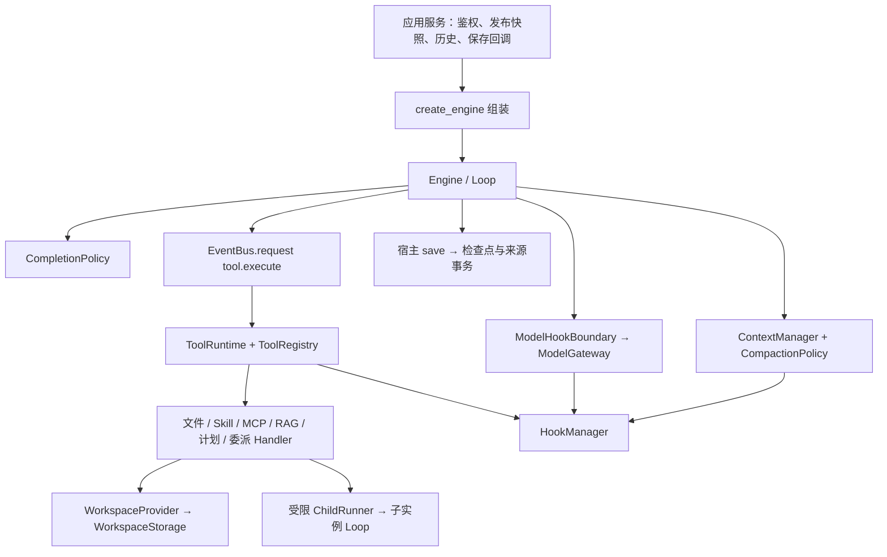

# AgentLoom Runtime 技术设计

更新：2026-10-09。代码基线：`9941e31`。本文描述当前可调用的接口、数据流与恢复边界；明确标为“目标”的内容尚未实现。

Runtime 是 AgentLoom 的执行核心。管理端负责资源、草稿、发布和访问控制；Runtime 接收已解析的发布快照，在固定权限与预算内执行一次任务。网页和 API 使用同一运行入口。

## 1. 能力与实现状态

| 能力          | 当前实现                                                          | 边界或后续目标                                              |
| ------------- | ----------------------------------------------------------------- | ----------------------------------------------------------- |
| 持续行动循环  | 模型行动、工具观察、错误反馈、计划修订、完成检查                  | 并非一次模型请求，也不是完整复刻 Codex / Claude Code        |
| 模块注入      | 模型、上下文、压缩、完成策略、执行策略、Hooks、工具、工作区可替换 | 使用可信 Python 接口，运行中热替换未开放                    |
| 主 / 子 Agent | 同一内核、独立实例状态与工作区、显式委派                          | 子任务顺序执行，不支持嵌套、独立模型或独立模式              |
| 事件总线      | 进程内 `asyncio` 请求 / 响应及只读通知                            | 无持久消息队列、跨机路由或自动投递重试                      |
| 系统文件工具  | 列表、搜索、读取、写入、编辑、目录、删除、容器命令                | 原生多文件 Patch、交互式 PTY、图片读取未实现                |
| Hooks         | 可信处理链、阶段校验、冻结版本、持久恢复、Embedding 挂点          | Hook 包上传 / Git 导入、可视化管理、隔离 Hook Worker 未实现 |
| 连续上下文    | 来源记录、模型视图、会话历史、压缩快照及恢复                      | 精确来源块、通用大结果引用、资源撤权后投影失效待建设        |
| 共享文件      | 本地或已挂载 POSIX 共享卷，作用域隔离与卷标识校验                 | 不自动安装 NFS；共享文件不等于集群任务调度                  |
| 长期 Memory   | 尚未实现 `MemoryService`                                          | 不把历史、摘要、RAG 或检查点称为长期记忆服务                |

上述状态以源码为准。真实模型供应商、Docker 和 NFS 的环境验证属于部署验证，不能仅由接口或模拟测试推定通过。

## 2. 身份、执行范围与数据所有者

| 身份                  | 含义                                        | 当前约束                                                          |
| --------------------- | ------------------------------------------- | ----------------------------------------------------------------- |
| `space_id`            | 团队空间                                    | Agent 与资源受空间权限控制                                        |
| `agent_id` / 发布版本 | Agent 定义及被冻结的运行配置                | 必须发布后才能运行；草稿修改不改写旧 Run                          |
| `session_id`          | 同一用户围绕同一 Agent / 发布版本的连续会话 | 会话原文与产物按创建者权限访问，不因团队共享 Agent 而共享个人会话 |
| `run_id`              | 一次新提问的执行记录                        | 新提问新建 Run；恢复沿用原 Run                                    |
| `instance_id`         | Run 内的执行实例                            | 主实例 `main`；子实例 `sub-1` 至 `sub-8`                          |
| `call_id`             | 模型生成的工具调用 ID                       | 关联 assistant 的调用与 tool 的结果                               |
| `request_id`          | 宿主生成的工具请求 ID                       | 同一调用恢复保持不变；同批后续调用使用新 ID                       |
| `operation_id`        | 模型、工具、Hook 等持久操作的身份           | 用于阶段恢复，不能用新的 ID 伪装为原操作重试                      |

这里的 Run / instance 是业务执行单元，不是操作系统线程。一次提问的多轮 Loop 使用同一实例上下文；同一会话的新提问建立新的执行状态，再继承历史资料。

发布快照包含配置、模型对象以及绑定的 Skills、MCP 和知识库资源。应用服务解析可信 Hooks、工作区与历史，再创建 Runtime。源码入口：[运行服务](../apps/api/agentloom/services/runs.py)、[发布服务](../apps/api/agentloom/services/agents.py)、[配置模型](../apps/api/agentloom/schema.py)。

## 3. 组装与依赖方向



[runtime.py](../packages/runtime/agentloom_runtime/runtime.py) 是组装入口。它选择默认实现，校验版本，注册工具，再把已经确定的模块交给 Engine；Loop 不根据 MCP、文件或 Skill 名称分支执行。

当前 `create_engine` 关键字注入点：

```python
create_engine(
    snapshot, workspace, emit, decrypt, search,
    checkpoint=None, save=None, configure_tools=None,
    *, model_gateway=None, compaction_policy=None,
    completion_policy=None, strategy=None, limits=None,
    registry=None, context_manager=None, hooks=None,
    hook_scope=None, workspace_provider=None,
)
```

`snapshot` 与检查点会复制后使用。`decrypt` 只进入需要凭据的默认适配器；Loop 不持有供应商 Key 或 MCP 客户端。`search` 是宿主提供的检索能力，Runtime 不导入 API 数据库实现。

只有工具执行目前通过事件总线；模型、压缩、完成检查通过各自注入端口调用。它们统一经过能力边界与 Hooks，不应把当前设计描述成“所有模块都已经通过总线远程调用”。

## 4. 当前模块与真实端口

核心契约见 [module_contracts.py](../packages/runtime/agentloom_runtime/module_contracts.py)，组装绑定见 [modules.py](../packages/runtime/agentloom_runtime/modules.py)。

| 模块                       | 当前接口 / 默认身份                                                                      | 职责                                                       |
| -------------------------- | ---------------------------------------------------------------------------------------- | ---------------------------------------------------------- |
| ModelGateway               | `invoke(ModelRequest) -> dict`；`chat-completions/v1`                                    | 供应商请求、凭据解析与响应返回                             |
| ContextManager             | `create / restore / append / queue_input / drain_inputs / prepare`；`journal-context/v1` | 来源、模型视图、排队输入、压缩快照与计数                   |
| CompactionPolicy           | `compact(ContextInput, ModelCall) -> CompactionResult \| None`                           | 判断阈值，生成候选压缩视图；预算策略为 `budget-handoff/v1` |
| TokenEstimator             | `estimate(messages, tools) -> int`                                                       | 当前 `utf8-bytes-with-framing/v1`，可注入替代实现          |
| CompletionPolicy           | `review(CompletionInput, ModelCall) -> CompletionDecision`；`evidence-review/v1`         | 决定完成、继续或阻塞                                       |
| ExecutionStrategy          | `instructions / candidate_feedback / authorize_tool`                                     | `react/v1` 与 `plan/v1` 的行为差异                         |
| HookManager                | `run / checkpoint_config / aclose`；`hooks/v1`                                           | 版本化、持久化的前后置处理链                               |
| ToolRegistry / ToolRuntime | `register / resolve / definitions / validate` 与统一执行入口                             | 冻结目录、Schema、资源准入、调用恢复                       |
| WorkspaceProvider          | `for_instance / checkpoint_binding`                                                      | 由宿主身份解析实例工作区，不接受模型指定根目录             |
| WorkspaceStorage           | `read / write / list / stat / glob / grep / edit / mkdir / delete` 等                    | 文件后端；默认 `PosixWorkspaceStore`                       |

`CompactionPolicy` 的 Protocol 当前只要求 `compact`。宿主另外按方法是否存在调用 `validate_request(ModelRequest)` 和 `validate_compaction_result(original, replacement, tools)`：前者检查最终请求预算，后者检查压缩结果及摘要 Hook 加工后的预算。`BudgetCompactionPolicy` 实现这两项；旧 `CharacterCompactionPolicy` 保留字符压缩与摘要结果检查，不提供逐请求的模型窗口硬限制。自定义策略若省略这些可选方法，也不会自动获得相同的窗口保证；必须显式实现对应校验并声明版本。模型调用次数上限仍由 Engine 独立执行。

`RuntimeModules.bindings()` 保存 `model / compaction / completion / strategy / context / hooks` 的实现与 JSON 配置，以及 limits。工具绑定由 Engine 加入同一检查点；工作区身份单独保存在 `workspace_binding`。

每个注入模块须声明非空、带兼容版本含义的 `module_id`。影响恢复的参数通过 `checkpoint_config()` 声明；省略该方法意味着配置按空对象记录，不能依赖它自动识别任意 Python 对象内部变化。

模块对象属于本次 Engine。宿主在 `finally` 中 `await engine.close()`；关闭先取消并等待活动执行，再清理工具总线，随后依次关闭策略、完成、上下文、压缩、模型、Hooks。重复对象只关闭一次，关闭后不再接收执行。

## 5. 模型和工具的数据契约

| 类型                 | 字段                                                                                                  | 使用规则                                                         |
| -------------------- | ----------------------------------------------------------------------------------------------------- | ---------------------------------------------------------------- |
| `ModelRequest`       | `messages, tools, purpose, instance, options`                                                         | 普通行动、压缩、完成检查共用网关；options 当前承载采样与输出上限 |
| 模型响应             | `role, content?, tool_calls?, reasoning_content?`（规范化后的消息；其他原始响应信息不自动进入该消息） | 必须有有效回答或调用；调用 ID 不重复，工具参数仍是 JSON 字符串   |
| `ContextInput`       | `task, plan, messages, instance, tools, counters`                                                     | 压缩策略获得工作副本，返回新视图而非直接修改 frame               |
| `CompactionResult`   | `messages, metrics, summary?`                                                                         | summary 是允许 Hook 改写的显式摘要位置，不是整份原始记录         |
| `CompletionInput`    | `task, plan, evidence, messages, candidate, instance`                                                 | 完成判断读取候选交付与实际证据                                   |
| `CompletionDecision` | `decision, reason, next_action`                                                                       | decision 为 `complete / continue / blocked`                      |
| `ToolRequest`        | `call_id, name, arguments, uncertain`                                                                 | Loop 只提交统一请求，不携带可由模型改写的授权上下文              |
| `ToolOutcome`        | `value, status, evidence_arguments, raw_value, has_raw_value`                                         | 区分模型可见结果和真实工具结果，供历史及完成检查使用             |

工具完整定义见 [tool_contracts.py](../packages/runtime/agentloom_runtime/tool_contracts.py)。`ToolContext` 是宿主构造的可信对象：深只读 config、实例、观察出口，以及 `plan`、`children`、`citations`、`invocation` 等有限接口；处理器不会获得 Engine 的 frame/state。

`runtime_state` 是 ToolRuntime 自己的持久命名空间；调用具体工具 Handler 时会移除。新文件工具通过注入的 WorkspaceProvider 解析路径；`ToolContext.workspace` 仍保留旧工作区语义，自定义文件工具不能把它当作新共享工作区解析器。

默认模型网关使用 DeepSeek / OpenAI 兼容的 Chat Completions，当前不使用 Responses API，也不逐 token 输出模型响应。页面事件流是执行事件流；完整模型响应到达并校验后才执行工具。见 [model_gateway.py](../packages/runtime/agentloom_runtime/model_gateway.py)、[provider.py](../packages/runtime/agentloom_runtime/provider.py)。

## 6. 一次任务如何持续执行

[Engine](../packages/runtime/agentloom_runtime/engine.py) 每个实例保存独立 frame。一次循环的核心顺序如下：

1. 先处理检查点中未完成的工具组；保留调用与结果的关联。
2. 在安全边界接收排队的用户补充；已有模型操作的结果先按原身份处理。
3. 若有候选答案，调用 CompletionPolicy；需要继续时把反馈加入上下文。
4. 通过 ContextManager 准备模型视图，需要时触发压缩。
5. 保存模型操作身份，通过模型 Hooks、预算检查与 ModelGateway 请求模型。
6. 保存真实模型结果和经过 Hook 处理的可见视图。
7. 有 `tool_calls` 则建立 pending 组，逐个发送 `tool.execute` 并等待结果。
8. 无调用时，先满足策略要求，再保存候选答案；下一轮完成检查后交付。

工具失败通常成为统一失败结果，模型可以观察后调整；持久化失败和需要恢复的 Hook 故障会停止执行，不能伪装成普通工具失败继续循环。

默认限额为每次执行/恢复共享 96 次聊天模型调用、每实例 64 个行动模型轮次。主实例、子实例、压缩和完成检查共用模型调用总预算；恢复会重置本次执行预算，同时保留 `total_calls` 等历史，不重置会话压缩计数。

默认完成检查调用同一模型，结合计划、最近证据与近期消息返回三态。它当前裁剪最近 12 条证据、8 条消息等内容；并非证明任务正确的形式化校验。即使模型返回 complete，只要计划仍有 pending / in_progress，就被改为 continue。源码：[completion.py](../packages/runtime/agentloom_runtime/completion.py)。

## 7. Plan、ReAct 与子 Agent

Plan 和 ReAct 使用同一个 Loop，差异由 [ExecutionStrategy](../packages/runtime/agentloom_runtime/execution_strategy.py) 决定。

| 行为             | ReAct                            | Plan 主实例                                                            |
| ---------------- | -------------------------------- | ---------------------------------------------------------------------- |
| 简单问题直接回答 | 可以，仍经过完成检查             | 先创建计划后才能进入交付                                               |
| 使用计划         | 复杂任务可自行调用 `update_plan` | 要求先 `update_plan`，随后自动执行，不等待人工批准                     |
| 计划前工具       | 按资源授权执行                   | 仅 `before_plan=True` 的工具可用，例如计划工具及新目录中的只读文件工具 |
| 动态调整         | 可以新增 / 修改 / 取消步骤       | 相同机制，按实际结果更新                                               |

计划每次提交完整列表，1–12 步，ID 唯一，同一实例最多一个 in_progress；修改已有计划需要说明原因。步骤状态为 pending、in_progress、completed、cancelled。计划工具与其他能力一样经过总线和 Hooks，不由 Loop 识别工具名。见 [planning.py](../packages/runtime/agentloom_runtime/planning.py)。

子 Agent 是主 Agent 发布配置内的职责模板。配置包含名称、职责、Prompt、Skills、工具、知识库；没有模型、mode 或嵌套 subs 字段。主实例通过 `delegate_task(subagent_id, task)` 选择已发布模板，并传入具体任务及必要背景。

- 子实例继承同一个模型网关、预算、压缩策略和按 instance 匹配的 Hook 链。
- Plan 的“必须先建计划”限制只作用于主实例；子实例执行被委派任务，没有独立 Plan / ReAct 配置。
- 子实例有独立上下文、计划、证据、pending 与工作区；初始历史为空，不自动复制父实例所有对话。
- 子实例不能继续委派。每个 Run 最多创建 8 个子实例；恢复沿用已保存的 child_instance，不再占用新名额。
- API 允许配置最多 10 个职责模板，和一次 Run 最多 8 次实际委派是不同限制。
- 当前工具调用和委派顺序执行，父实例等待子结果后继续；没有并行调度、任务窃取或动态生成新模板。

子任务仍调用同一 Engine 的子实例 Loop，受限适配器负责保存身份与状态。实现见 [delegation Handler](../packages/runtime/agentloom_runtime/handlers/delegation.py)、[execution_services.py](../packages/runtime/agentloom_runtime/execution_services.py)。

## 8. 总线请求与观察通知

[EventBus](../packages/runtime/agentloom_runtime/event_bus.py) 是单进程请求 / 响应总线。每个 topic 只有一个执行 Handler；工具统一使用 `tool.execute`。`register()` 返回释放句柄，存在在途请求时不能注销。

`Event` 包含 `topic, correlation_id, payload, context`。request 的 context 可携带当前进程可信 ToolContext；它不是可直接通过 JSON 发给其他机器的协议。

`subscribe / publish` 用于观察，可有多个订阅者。发布内容必须为可冻结的 JSON 数据；观察者不能改请求、阻止工具或替换返回结果。修改出入参和拒绝执行由 Hooks 完成。

自动通知为 `request.started / completed / failed / cancelled / timed_out`，只携带 topic、关联 ID 及宿主显式提供的标量元数据，不自动广播完整工具参数、返回值或 ToolContext。`tool.started / completed / failed` 等应用执行事件另由宿主保存并展示。

因此写文件是“发送请求给唯一执行者，等待结果，再发观察通知”，不是向多个消费者广播写操作。总线不自动重试副作用，不持久化请求，也不承诺 exactly-once。

每个请求拥有独立异步任务，允许委派 Handler 等待子实例，子实例再请求工具而不堵塞单 worker 队列。这种可重入能力不表示当前 Loop 已并行执行同批工具。

取消传播到请求处理器，并等待协作清理与终态通知。ToolRuntime 关闭自有总线；外部注入总线时只清理自己的 topic。恶意或不配合取消的可信 Python 处理器并不因此获得硬隔离。详见[事件总线专题](runtime-event-bus.md)。

## 9. ToolRuntime 与能力接入

[ToolRuntime](../packages/runtime/agentloom_runtime/tool_runtime.py) 的执行次序是：解析调用 → 解析已绑定工具 → JSON Schema 校验 → 策略准入 → tool.before → 再校验与准入 → Handler → 保存真实结果 → tool.after → 返回 ToolOutcome。

`ToolDefinition` 还声明 `available(config, instance)`、`before_plan`、`resume_inflight`、`timeout`、`evidence_fields`、`implementation_id`、`tool_id`。模型可见目录与真实调用授权均检查 available，知道名称不等于获得使用权限。

目录在 ToolRuntime 组装时冻结。`configure_tools(registry)` 追加可信工具；传入 `registry=...` 则完全替换内置目录，宿主自行注册需要的能力。示例：

```python
from agentloom_runtime.tool_contracts import ToolDefinition

async def count_words(context, arguments):
    return {"count": len(arguments["text"].split())}

def configure_tools(registry):
    registry.register(ToolDefinition(
        name="count_words", description="统计文本中的词数",
        parameters={
            "type": "object", "properties": {"text": {"type": "string"}},
            "required": ["text"], "additionalProperties": False,
        },
        handler=count_words, implementation_id="count-words/v1",
        tool_id="count_words", resume_inflight=True,
    ))
```

这只是纯计算工具的注册示例。只有能安全恢复的能力才声明 `resume_inflight=True`；含外部副作用时默认关闭。自定义工具恢复必须有 implementation_id，Schema、描述、策略字段和版本均参与兼容校验。仅修改函数而不更新版本，不会像 Hooks 一样自动获得代码指纹检查。

### 系统文件工具

新工作区注册如下工具；参数均为当前实例的相对路径，不允许模型选择空间、会话或真实挂载根目录。源码：[filesystem.py](../packages/runtime/agentloom_runtime/handlers/filesystem.py)。

| 工具                                   | 核心行为                                             |
| -------------------------------------- | ---------------------------------------------------- |
| `workspace_list` / `workspace_stat`    | 列目录；查看类型、大小、可用时的内容哈希             |
| `workspace_glob` / `workspace_grep`    | 路径通配；内容与行号检索，默认字面匹配，正则有时限   |
| `workspace_read`                       | 按行读取，返回起止行、内容、大小、sha256、截断信息   |
| `workspace_write`                      | 原子替换文件，可传 expected_sha256；空串要求仅新建   |
| `workspace_edit`                       | 精确文本替换，多处匹配默认拒绝，可显式 replace_all   |
| `workspace_mkdir` / `workspace_delete` | 建目录；仅删除单个普通文件，不递归删除目录           |
| `workspace_command`                    | Docker 内一次 shell 调用，文件保留，进程不跨调用保留 |

只读文件工具允许按恢复契约重新读取；写入、编辑、删除与命令不盲目重复未知副作用。工作区后端限制普通文件访问，拒绝越界、符号链接、硬链接和特殊文件；提供原子替换、写锁、内容哈希校验及扫描预算。

### Skill、MCP 与知识能力

Skill 导入支持文件夹与 Git；当前每次导入一个含唯一 `SKILL.md` 的技能目录，YAML frontmatter 需要 name、description。发布时绑定技能；Prompt 先给可用技能摘要，模型按需调用 `skill_load` 读取正文、`skill_read` 读取附件，不把所有附件预先塞入上下文。

支持 Skill 文档和附带文件，不代表实现了 Codex / Claude Code 的所有专有 frontmatter、宿主命令或依赖。脚本通过受限 workspace_command 执行；SKILL.md 是输入资料，不能自行增加工具或跨作用域访问。见 [Skill Handler](../packages/runtime/agentloom_runtime/handlers/skills.py)、[导入校验](../apps/api/agentloom/assets.py)。

MCP 是外部工具协议。已发现并发布的 Schema 被适配为独立 ToolDefinition，稳定身份为 `mcp:{资源ID}:{远端工具名}`；模型看到的是受控别名。支持外部 Streamable HTTP / SSE，以及 Docker 托管的 stdio 服务；每次调用建立并关闭 MCP 会话，目前没有持久连接池。

开发者可用[工具 SDK](../packages/tool-sdk/agentloom_tools/__init__.py)编写托管工具，也可实现外部 MCP 服务。托管 MCP 与 workspace_command 使用不同执行适配器，不应推定两者共享工作区挂载或完全相同的清理协议。见 [MCP 适配](../packages/runtime/agentloom_runtime/mcp_tools.py)。

`knowledge_search` 只搜索当前配置已绑定的知识库，返回可引用片段并保存引用元数据。宿主若提供 `search_with_context`，查询向量调用会接入独立恢复状态；旧普通 search 回调不默认具有这个保证。本次文档整理不新增知识库功能，索引与 Embedding 详情见[现有专题](embedding-hooks-v0.1.md)。

## 10. 工作区、共享卷与命令沙箱

文件执行路径为 `tool.execute → ToolRuntime → 文件 Handler → WorkspaceProvider → WorkspaceStorage`。后端同步 I/O 通过 `storage_call` 放入工作线程；取消时等本次 I/O 结束，防止残留写入与恢复后的请求竞争。

平台新 Run 的主目录和子目录为：

```text
<root>/spaces/<space>/agents/<agent>/sessions/<session>/main/
<root>/spaces/<space>/agents/<agent>/sessions/<session>/runs/<run>/children/<instance>/
<root>/.agentloom-locks/<session-scope-hash>/
```

同会话的新提问复用 main 文件；不同 Agent、会话及子实例隔离。子目录不位于主挂载目录内，锁目录也不暴露给容器。主目录是可变工作区，不是每个历史 Run 的不可变产物快照。

`local` 为开发默认；`shared_posix` 用于预先挂载的 NFSv4.1 / NAS。共享模式要求绝对根路径、固定卷 ID 与 `.agentloom-volume` 标记，挂载缺失不能自动回退为本机空目录。同一会话保持同一卷绑定；旧未绑定 Run 保留原有 `data/runs/<run>` 和旧工具目录。

源码：[WorkspaceProvider](../packages/runtime/agentloom_runtime/workspace.py)、[POSIX 后端](../packages/runtime/agentloom_runtime/workspace_store.py)、[平台作用域](../apps/api/agentloom/services/workspaces.py)。共享锁要求各执行者使用同一存储与锁协议，实际部署须验证 NFS 锁与 UID/GID 映射。

命令容器在执行宿主上启动，仅挂载当前实例为 `/workspace`、绑定技能为只读 `/skills/<id>`；禁止网络，根文件系统只读，限制 CPU / 内存 / PID，并清理平台凭据环境。要求非 root 宿主用户与本地 Docker Unix socket；缺少 Docker 时拒绝执行，不退到宿主 shell。

每次启动前在锁目录写持久执行标记，确认对应容器清理后才移除。宿主崩溃或清理结果不明时，标记继续阻止写入与新命令，允许只读核查；不能通过超时自动认定旧容器已经停止。源码：[sandbox.py](../packages/runtime/agentloom_runtime/sandbox.py)。

NFS 存放文件，不承载容器进程。当前没有总磁盘配额服务、沙箱池、Hook Worker 或跨节点运行租约；存储容量配额应由实际文件系统配置。部署和校验方法见[系统工具与共享工作区](system-tools-shared-workspace-v0.1.md)。

## 11. Hooks：统一处理链而非观察订阅

HookRegistry 注册可信异步处理器及版本；HookPointRegistry 定义载荷、可写字段与允许动作；HookManager 按发布绑定匹配并执行；HookExecutor 管理协作式超时与取消。它们都是当前运行包内可导入的实现，源码目录为 [hooks](../packages/runtime/agentloom_runtime/hooks)。

| 挂点                                            | 可观察或改变的范围                                                                                      |
| ----------------------------------------------- | ------------------------------------------------------------------------------------------------------- |
| `model.chat.before / after`                     | 前置可追加受限 user 材料、调整受预算约束的采样 / 输出参数；后置可改正文与 annotations，不改工具调用协议 |
| `model.embedding.before / after`                | 前置变换文本但保持条数与索引；后置只读向量 / 用量；绑定属于知识库索引                                   |
| `tool.before / after`                           | 前置只改 arguments 或拒绝；后置改 value / annotations，不改真实状态和证据参数                           |
| `context.prepare.before / after`                | 前置追加标明来源的临时 user 材料；后置只读                                                              |
| `context.compact.before / after`                | 前置观察或拒绝；后置只改策略显式声明的摘要文本位置                                                      |
| `run.before / after`、`subagent.before / after` | 前置观察或拒绝；后置只加 annotations，保留任务实际结果与状态                                            |
| `operation.error / finally`                     | 只读诊断；不能替换原错误、重复动作或自行决定恢复                                                        |

处理器返回 Continue、PatchInput、PatchOutput 或 Reject。Patch 按顶层字段替换，每次应用后重新校验；没有通用 around(next)、任意短路或直接调用底层执行回调。

HookContext 暴露只读 config、scope 与身份字段，不传 Key、连接、Engine 或任意环境变量；可信 Python 代码依然具有进程权限，这不是不受信任代码的沙箱。上传 Hook、Git Hook 和独立隔离 Worker 尚未开放。

同阶段按 priority 升序、同优先级按发布顺序执行；before / after / error / finally 分别排序，不隐式逆序退出。默认 Chat 只匹配 action，Embedding 默认 document/query；内部模型 purpose `verification` 在 Hook 匹配层映射为 completion。

默认每个绑定超时 1 秒、阶段总预算 10 秒。调度与 `ctx.remaining_seconds()` 使用事件循环单调时钟；`ctx.deadline` 保留墙钟展示兼容，不能用于计算预算，单调 deadline 也不能持久化后跨进程比较。

只有 observation=True 的观察扩展能选择失败后 continue；观察扩展只能返回 Continue。error / finally 的普通处理器异常记录为诊断，不覆盖原错误。replay_safe 默认 False，只能对允许重算的处理器开启。

### 契约版本、代码身份与发布恢复

HookManager 模块身份仍为 `hooks/v1`，不等于挂点 Schema 的版本。新配置使用 `point_contract_version: 2`：声明实际必需字段并禁止未知顶层字段；usage、annotations 等保持可选，压缩与诊断载荷按实际协议校验。

旧清单缺少该版本字段时，用 `HookManager(..., saved_config=原配置)` 重建宿主内置 v1 契约并核对完整清单。检查点里的 Schema 不能安装为任意执行规则；自定义挂点须由宿主显式注册。旧任务不能恢复途中增加 Hook 或悄悄切换契约。

普通文件函数保留源码 SHA-256；无源码动态函数采用带类型、递归排序常量的 bytecode-v2 指纹，避免无序集合 repr 导致跨进程随机差异，并包含 Python 运行时版本。函数指纹不覆盖全部闭包、装饰器依赖、全局配置、实例状态和包依赖；这类发布身份应使用明确的制品 code_hash。

旧动态哈希只在当前部署可以精确重算匹配时兼容；无法验证则继续阻断，不能忽略差异。详细 SDK、恢复示例与限制见 [Hooks 使用说明](hooks-runtime-v0.1.md)。

## 12. 连续上下文与会话历史

当前 ContextManager 将三类数据分开：

| 数据              | 内容                                                       | 压缩影响                     |
| ----------------- | ---------------------------------------------------------- | ---------------------------- |
| `context.records` | 当前 Run / instance 的来源，含局部 seq、kind、message      | 追加保存，不被摘要覆盖       |
| `frame.messages`  | 系统指令、继承历史、当前任务、摘要、近期消息与可见工具结果 | 可以替换为经过校验的模型视图 |
| 执行检查点        | pending、计划、候选答案、真实结果、子实例与操作阶段        | 不从摘要推断执行进度         |

Hook 加工后的模型 / 工具可见内容与原始事实分别保存。工具可见结果目前仍限制前 24,000 字符；收到的完整原始结果保留于来源 / 操作记录，但工具自身已经截断的内容不会凭空恢复。尚无统一的大结果对象引用与回读系统。

实例局部 seq 与数据库 `session_messages.seq` 不同。宿主在同一会话事务内同步来源、加密检查点和合规视图，以 Run、实例、entry_key 去重；失败、取消和补充中已经提交的记录保留。源码：[JournalContextManager](../packages/runtime/agentloom_runtime/context_manager.py)、[session_history.py](../apps/api/agentloom/services/session_history.py)。

新提问读取主实例连续历史，不再限定最近 6 个成功任务或最终问答。子实例来源也保存，但新主实例继承主实例历史和收到的委派结果，不自动展开所有子实例内部消息。

历史投影会重写 call ID；缺结果的调用补上 unknown 占位，迟到结果成为资料文本，绝不在新 Run 自动执行旧工具。历史提供事实，不扩大新运行的资源授权。

成功压缩后的 `session_views` 只覆盖确实观察过的连续主历史前缀。新 Run 使用最高合规水位的视图，再追加后续记录。恢复旧 Run A 不会自动加载之后 Run B/C 的历史，也不能用 A 的局部快照覆盖未观察的 B/C。

同一次任务的补充先进入持久 pending_inputs；工具组与既有模型操作在安全边界处理后再注入。恢复继续原 frame，不重新计算会话历史。旧检查点缺失原始内容时只能保留尚存后缀，标记 raw_complete=False，不能把旧摘要认定为完整来源。

## 13. 主动压缩、计数与 Memory

新发布配置默认预算策略；缺少 context_policy 的旧发布版本保留 60,000 字符触发、16,000 字符近期目标的 `character-handoff/v1`，不会原地升级旧 Run。

```text
有效输入预算 = context_window - max_output_tokens - safety_margin_tokens
触发 = 估算(messages + tools) >= 有效输入预算 × context_ratio
    或 user_turns - baseline_user_turns >= 已配置轮数
    或 model_steps - baseline_model_steps >= 已配置步骤数

默认：context_ratio=0.8，target_ratio=0.6
      user_turns=null，model_steps=null，max_compaction_calls=4
```

80% 指有效输入预算的估算占用，不是收到供应商超限错误才压缩。当前 estimator 按 UTF-8 JSON 字节及消息 / 工具封装估算，不是精确 Tokenizer；可能明显提前触发。未知模型的 32,768 窗口只是平台回退配置，不代表所有供应商模型的实际窗口。

user_turns 按新提问增加；恢复、补充和重试不额外增加。model_steps 统计实例已保存的 action 模型响应；摘要与完成检查不算，子实例不增加父实例计数。成功压缩才推进基线，后续 Run 从来源与合规视图继承计数。

压缩保留系统指令、任务和计划，按完整 assistant/tool 调用组选择近期历史；较大的完成组被序列化为有序资料片段生成交接摘要，不拆成孤立协议消息。成功要求视图缩小并低于触发阈值；60% 是目标而非保证，metrics 中记录 target_reached。

无可压缩历史、无减量收益或必要内容仍在硬预算内时可能跳过；超硬预算则在请求前停止。摘要失败不替换原视图、不推进基线。每次准备有摘要调用上限，但跨恢复的持久失败退避与增长门槛尚未实现。

快照记录 revision、covered_seq、messages、history_watermark、counters、metrics。covered_seq 是该视图观察到的实例水位，不是摘要正文逐条引用了哪些原记录的精确映射。详见[上下文实现](runtime-context-v0.2.md)。

**MemoryService 当前不存在。** 目标是独立的长期事实 / 偏好服务，负责来源、作用域、提取审核、冲突、有效期、删除、摘要注入与详情查询；后台提取任务、存储端口和模型可调用记忆工具均待实现。它不应替代连续历史，也不能把未经核实的压缩摘要自动当成长期事实。

## 14. 检查点、恢复与故障语义

Runtime 通过同步 `save(state)` 保存 JSON 状态；保存失败转为 ToolPersistenceError 并停止。API 宿主负责实际加密存储和事务，Runtime 本身没有独立 StateStore / CheckpointStore 后端。核心检查点仍为 format=1。

| 区域                                            | 保存内容                                                                            |
| ----------------------------------------------- | ----------------------------------------------------------------------------------- |
| `modules` / `workspace_binding`                 | 模块配置、工具目录、Hook 清单与工作区身份                                           |
| `calls / total_calls / delegations / citations` | 本次与累计模型调用、子实例数量、引用元数据                                          |
| `frames[instance]`                              | task、messages、context、plan、evidence、iterations、pending、candidate、outcome 等 |
| `operations`                                    | 模型及其辅助调用的 durable operation，供阶段恢复                                    |
| `lifecycles` / `lifecycle_history`              | 主任务与子任务生命周期操作及已完成轮次                                              |
| `tool_operations[request_id]`                   | 每次工具操作记录，同批多个调用分别保存                                              |
| `context_operations` / frame 的准备状态         | 上下文装配、压缩和当前模型周期的恢复资料                                            |

一次 durable operation 保存 original_input、before_input / final_input、raw_output、effective_output、实际状态、处理阶段、before / after 游标和 attempts。空 Hook 链也走此流程，因为真实结果先保存和恢复不重复调用是能力边界的职责。

| 中断位置                               | 当前处理                                                             |
| -------------------------------------- | -------------------------------------------------------------------- |
| before 拒绝                            | 实际动作未开始；按调用边界返回拒绝或阻断 Run                         |
| 真实结果已保存，after 失败             | 从保存的 raw_output 继续，已完成 Hook 不重跑，不重新调用模型或工具   |
| 未完成 Hook 可能有副作用               | 未声明 replay_safe 时要求核对，不盲目执行                            |
| 普通工具执行结果未知                   | 不自动重放；允许恢复的子委派、只读文件或持久检索各遵守自己的恢复契约 |
| 模型请求已发出、响应未知               | 默认阻断；明确 retry_unknown_models=True 后才允许再发，可能再次计费  |
| 模块 / 配置 / 工具 / Hook / 卷身份改变 | 拒绝恢复，须使用原版本或另行实现明确迁移                             |
| 保存失败                               | 停止，不继续消耗工具进度或假装成功                                   |

供应商适配器只对明确连接失败或部分可重试状态做有界重试；读取超时、已发送请求后断连不自动重复请求。文件执行未知状态还受持久容器标记约束，数据库恢复许可不能越过这个存储保护。

恢复不会自动把最新草稿、最新模型预算或新资源版本套到旧运行。恢复预算重新开始是执行额度语义，和更换发布配置是两件事；当前没有通用检查点迁移工具。

## 15. 扩展与后续模块化边界

现有扩展按以下入口接入，并为影响恢复的行为声明版本：

| 扩展需求                 | 已有接入方式                                          | 必须遵守                                              |
| ------------------------ | ----------------------------------------------------- | ----------------------------------------------------- |
| 换模型协议               | 注入 ModelGateway                                     | ModelRequest / 响应协议、统一预算、完整结果校验       |
| 换压缩 / 完成 / 行动规则 | 注入对应 Protocol 实现                                | 不直接修改 Engine；模型调用使用宿主 ModelCall         |
| 加可信工具               | configure_tools 或完整 ToolRegistry                   | 资源准入、Schema、implementation_id、未知结果恢复规则 |
| 加外部工具               | MCP 服务与工具 SDK                                    | 使用发布目录、远端调用实际权限和超时策略              |
| 改出入参或拒绝           | 注册可信 HookDefinition 并冻结 HookBinding            | Schema、可写字段、明确 replay_safe 与代码身份         |
| 换文件后端               | WorkspaceProvider 的 store_factory / WorkspaceStorage | 作用域解析、稳定身份、锁、取消与执行标记语义          |

可信进程内接口并不构成上传代码沙箱。只有明确接入受限执行器后，才可开放不受信任扩展。

下一阶段目标：独立版本化状态仓储与 CAS、PlanManager / ChildTaskManager 持久端口、类型化来源和资源版本、MemoryService、Hook Worker、持久队列、任务租约 / 心跳 / fencing、外部副作用幂等与核对流程。它们目前不是可导入的完整 SDK 模块。

现有应用使用进程内 TASKS；启动恢复逻辑会处理数据库中的 queued / running 状态。故不能直接启动多台实例就宣称支持可靠集群接管。NFS 只解决文件共享，PostgreSQL 只解决已实现的事务与状态保存；A 机器中断后由 B 接管还需要运行所有权与防重复执行协议。

源码与回归定位：模型 / 端口见 [test_runtime_modules.py](../tests/test_runtime_modules.py)，总线见 [test_event_bus.py](../tests/test_event_bus.py)，上下文见 [test_context_hooks.py](../tests/test_context_hooks.py)，Hooks 兼容见 [test_hook_contract_compatibility.py](../tests/test_hook_contract_compatibility.py)，工作区见 [test_shared_workspaces.py](../tests/test_shared_workspaces.py)、[test_workspace_store.py](../tests/test_workspace_store.py)。这些测试对应机制验证，真实供应商、存储与容器仍须在目标环境验收。
